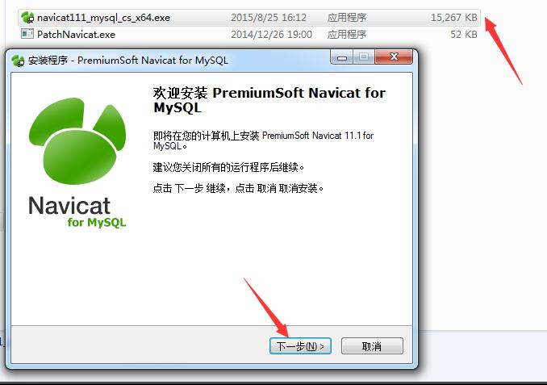

# 基础知识

## 一、初识MySQL

### 1、特性

1. 使用C和C++编写，并使用了多种编译器进行测试，保证源代码的可移植性。
2. 支持AIX、FreeBSD、HP-UX、Linux、Mac OS、NovellNetware、OpenBSD、OS/2 Wrap、Solaris、Windows等多种操作系统。
3. 为多种编程语言提供了API。这些编程语言包括C、C++、Python、Java、Perl、PHP、Eiffel、Ruby,.NET和Tcl等。
4. 支持多线程，充分利用CPU资源。
5. 优化的SQL查询算法，可有效地提高查询速度。
6. 既能够作为一个单独的应用程序应用在客户端服务器网络环境中，也能够作为一个库嵌入到其他的软件中。
7. 提供多语言支持，常见的编码如中文的GB 2312、BIG5，日文的Shift\_JIS等都可以用作数据表名和数据列名。
8. 提供TCP/IP、ODBC和JDBC等多种数据库连接途径。
9. 提供用于管理、检查、优化数据库操作的管理工具。
10. 支持大型的数据库，可以处理拥有上千万条记录的大型数据库。
11. 支持多种存储引擎。
12. MySQL是开源的，所以用户不需要支付额外的费用。
13. MySQL使用标准的SQL数据语言形式。
14. MySQL对PHP有很好的支持，PHP是目前最流行的Web开发语言之一。
15. MySQL是可以定制的，采用了GPL协议，用户可以修改源码来开发自己的MySQL系统。
16. 在线DDL/更改功能，数据架构支持动态应用程序和开发人员灵活性。
17. 复制全局事务标识，可支持自我修复式集群。
18. 复制无崩溃从机，可提高可用性。
19. 复制多线程从机，可提高性能。

### 2、安装MySQL

开源软件特点：

1. 降低风险
2. 质量更有保障
3. 透明
4. 剪裁
5. 有利的版权和许可价格

安装过程：

1、Windows端，本人使用了phpstudy直接安装\
2、Linux端，可通过使用源码包的方式下载，下载好之后进入命令行设置密码并重启服务即可

```
SET PASSWORD FOR'root'@'localhost'=PASSWORD('123456'); #在MySQL命令行中设置root账户的密码为123456
```

### 3、可视化管理工具

工具种类及详情如下：

1. MySQL Workbench：\
   MySQL Workbench是一个由MySQL开发的跨平台、可视化数据库工具。它作为DBDesigner4工程的替代应用程序而备受瞩目。MySQL Workbench可以作为Windows、Linux和OS X系统上的原始GUI工具，它有各种不同的版本。
2. Aqua Data Studio：\
   对于数据库管理人员、软件开发人员以及业务分析师来说，Aqua Data Studio是一个完整的集成开发环境（Intergrated Development Environment，IDE）。它主要具备了以下4个方面的功能：\
   &#x20;       ⑴数据库查询和管理工具；\
   &#x20;       ⑵一套数据库、源代码管理以及文件系统的比较工具；\
   &#x20;       ⑶为Subversion（SVN）和CVS设计了一个完整的集成源代码管理客户端；\
   &#x20;       ⑷提供了一个数据库建模工具（Modeler），它和最好的独立数据库图表工具一样强大。
3. SQLyogSQLyog：\
   是一个全面的MySQL数据库管理工具。它的社区版（Community Edition）是具有GPL许可的免费开源软件。这款工具包含了开发人员在使用MySQL时所需的绝大部分功能：查询结果集合、查询分析器、服务器消息、表格数据、表格信息，以及查询历史，它们都以标签的形式显示在界面上，开发人员只要单击鼠标即可。此外，它还可以方便地创建视图和存储过程。
4. MySQL-Front：\
   这个MySQL数据库的图形GUI是一个“真正的”应用程序，它提供的用户界面比用PHP和HTML建立起来的系统更加精确。因为不会因为重载HTML网页而导致延时，所以它的响应是即时的。如果供应商允许的话，可以让MySQL-Front直接与数据库进行工作。如果不行，也只需要在发布网站上安装一个小的脚本即可。
5. Sequel ProSequel Pro：\
   是一款管理Mac OS X数据库的应用程序，它可以让用户直接访问本地以及远程服务器上的MySQL数据库，并且支持从流行的文件格式中导入和导出数据，其中包括SQL、CSV和XML等文件。

以Navicat为例，下面是该软件的安装过程：

官方地址：http://www.navicat.com.cn/download/navicat-for-mysql

#### 1、Linux

1、下载文件到根目录后

```
sudo su    #切换到root账户
tar -zxvf navicat_for_mysql_10.0.11_cn_linux.tar.gz    #解压文文件到/opt/目录下
cd /opt/navicat    #进入软件的安装目录
./start_navicat    #启动Navicat
```

#### 2、Windows

1、双击安装程序，然后点击下一步



2、我同意→下一步


3、选择文件夹，并点击下一步


4、下一步→下一步→下一步→安装→完成，即可

5、双击打开破解程序，并选中安装好的navicat文件


6、等到出现这个界面后，破解成功


7、打开Navicat，并点击连接，可打开连接界面


8、在界面中，输入密码即可连接


9、下图是链接成功的界面状态


### 4、Windows7中单独卸载MySQL

1. 在Windows服务中停止MySQL的服务。
2. 打开“控制面板”，单击“程序和功能”，找到“MySQL”，右键单击从下拉菜单中选择卸载（或者使用其他软件卸载）。
3. 卸载完成后，删除安装目录下的MySQL文件夹及程序数据文件夹，如C:\Program Files(x86)\MySQL和C:\ProgramData\MySQL。
4. 在运行中输入“regedit”，进入注册表，将所有的MySQL注册表内容完全清除，具体删除内容如下：①HKEY\_LOCAL\_MACHINE\SYSTEM\ControlSet001\Services\Eventlog\Application\MySQL 目录删除；②HKEY\_LOCAL\_MACHINE\SYSTEM\ControlSet002\Services\Eventlog\Application\MySQL 目录删除；③HKEY\_LOCAL\_MACHINE\SYSTEM\CurrentControlSet\Services\Eventlog\Application\MySQL目录删除。
5. 操作完成重新启动计算机。

## 二、MySQL数据库基础

### 1、基础相关

1、MySQL版本分类：

1. MySQL Community Server，社区版本，开源免费，但不提供官方技术支持。
2. MySQL Enterprise Edition，企业版本，需付费，可以试用30天。
3. MySQL Cluster，集群版，开源免费，可将几个MySQL Server封装成一个Server。
4. MySQL Cluster CGE，高级集群版，需付费。
5. MySQL Workbench（GUI TOOL），一款专为MySQL设计的ER/数据库建模工具。它是著名的数据库设计工具DBDesigner4的继任者。MySQL Workbench又分为两个版本，分别是社区版（MySQL Workbench OSS）、商用版（MySQL Workbench SE）。

2、MySQL优势

1. MySQL是一个关系数据库管理系统。
2. MySQL是开源的。
3. MySQL服务器是一个快速、可靠和易于使用的数据库服务器。
4. MySQL服务器工作在客户/服务器或嵌入系统中。
5. 有大量的MySQL软件可以使用。

3、Oracle优点

1. 兼容性：\
   Oracle产品采用标准SQL，并经过美国国家标准技术所（NIST）测试。与IBM SQL/DS、DB2、INGRES、IDMS/R等兼容。
2.  可移植性：

    Oracle的产品可运行于很宽范围的硬件与操作系统平台上。可以安装在70种以上不同的大、中、小型机上；可在VMS、DOS、UNIX、Windows等多种操作系统下工作。
3.  可连接性：

    Oracle能与多种通信网络相连，支持各种协议（TCP/IP、DECnet、LU6.2等）。
4. 高生产率：\
   Oracle产品提供了多种开发工具，能极大地方便用户进行进一步的开发。
5.  开放性：

    Oracle良好的兼容性、可移植性、可连接性和高生产率使Oracle RDBMS具有良好的开放性。

### 2、关系型数据模型

一、数据模型：能表示实体类型及实体间联系的模型称为“数据模型”

数据模型分类：

1、概念数据模型：\
独立于计算机系统的数据模型，完全不涉及信息在计算机中的表示，只是用来描述某个特定组织所关心的信息结构

2、逻辑数据模型：\
直接面向数据库的逻辑结构，它是对现实世界的第二层抽象。\
逻辑数据模型应该包含数据结构、数据操作和数据完整性约束3个部分，通常有一组严格定义的无二义性语法和语义的数据库语言，人们可以用这种语言来定义、操作数据库中的数据。\
其中包括层次模型、网状模型、关系模型和面向对象模型。

其中：\
层次模型和网状模型已经很少应用\
面向对象模型比较复杂，尚未达到关系模型数据库的普及程度

3、关系模型：

由若干个关系模式组成的集合，关系模式的实例称为关系，每个关系实际上是一张二维表格。关系模型用键导航数据，其表格简单，用户只需用简单的查询语句就可以对数据库进行操作，并不涉及存储结构、访问技术等细节。

4、关系数据库相关：\
SQL语言是关系数据库的代表性语言，已经得到了广泛的应用。\
典型的关系数据库产品有DB2、Oracle、Sybase、SQL Server等。\
概念：\
关系数据库是以关系模型为基础的数据库，是一种根据表、元组、字段之间的关系进行组织和访问数据的数据库，它通过若干个表来存取数据，并且通过关系将这些表联系在一起。

5、数据库支持模型：

层次模型（Hierarchical Model）\
网状模型（Network Model）\
关系模型（Relational Model）

6、关系模型有3个组成部分：

数据结构\
数据操作\
完整性规则

7、关系模型中的术语：

1. 关系（Relation）：对应通常所说的一张表。
2. 元组（Tuple）：表中的一行即为一个元组，可以用来标识实体集中的一个实体，表中任意两行（元组）不能相同；
3. 属性（Attribute）：表中的一列即为一个属性，给每个属性起一个名称即属性名，表中的属性名不能相同。
4. 主键（Key）：表中的某个属性组，它可以唯一确定一个元组。
5. 域（Domain）：列的取值范围称为域，同列具有相同的域，不同的列也可以有相同的域。
6. 分量：元组中的一个属性值。
7. 关系模式：对关系的描述。可表示为：关系名（属性1，属性2，…，属性n）。

8、关系表格的性质

1. 属性值具有原子性，不可分解。
2. 没有重复的元组。
3. 理论上没有行序，但是使用时有时可以有行序。

9、关键码（键）：

性质：\
是用来标识行（元组）的一个或几个列（属性）。如果键是唯一的属性，则称为唯一键；反之由多个属性组成，则称为复合键

主要类型：

1. 超键：在一个关系中，能唯一标识元组的属性或属性集称为关系的超键。
2. 候选键：如果一个属性集能唯一标识元组，且又不含有多余的属性，那么这个属性集称为关系的候选键。
3. 主键：如果一个关系中有多个候选键，则选择其中的一个键为关系的主键。用主键可以实现关系定义中“表中任意两行（元组）不能相同”的约束。
4. 外键：如果一个关系R中包含另一个关系S的主键所对应的属性组F，则称此属性组F为关系R的外键，并称关系S为参照关系，关系R是依赖关系。为了表示关联，可以将一个关系的主键作为属性放入另外一个关系中，第二个关系中的那些属性就称为外键。

10、关系数据操作语言

概念：\
分为查询语句和更新语句两大类。查询语句用于描述用户的各类检索要求；更新语句用于描述用户的插入、修改和删除等操作。

特点：

1. 以关系为单位进行数据操作，操作的结果也是关系。
2. 非过程性强。很多操作只需指出做什么，而无需步步引导怎么去做。
3. 以关系代数为基础，借助于传统的集合运算和专门的关系运算，使关系数据语言具有很强的数据操作能力。

数据操作语句及释义：

| 操作            | 释义                                                                                                  |
| ------------- | --------------------------------------------------------------------------------------------------- |
| SELECT        | 按指定的条件在一个数据库中查询的结果，返回的结果被看作记录的集合                                                                    |
| SELECT...INTO | 用于创建一个查询表                                                                                           |
| INSERT INTO   | 用于向一个表添加一个或多个记录                                                                                     |
| UPDATE        | 用于创建一个更新查询，根据指定的条件更改指定表中的字段值。该语句不生成结果集，而且当使用更新查询更新记录之后，不能取消这次操作                                     |
| DELETE        | 用于创建一个删除查询，可从列在FROM子句之中的一个或多个表中删除记录，且该子句满足WHERE子句中的条件，可以使用DELETE删除多个记录                              |
| INNER JOIN    | 用于组合两个表中的记录，只要在公共字段之中有相符的值。可以在任何FROM子句中使用INNER JOIN运算，这是最普通的连接类型。只要在这两个表的公共字段之中有相符的值，内部连接将组合两个表中的记录 |
| LEFT JOIN     | 用于在任何FROM子句中组合来源表的记录。使用LEFT JOIN运算来创建一个左边外部连接。左边外部连接将包含从第一个（左边）开始的两个表中的全部记录，即使在第二个（右边）表中并没有相符值的记录   |
| RIGHT JOIN    | 用于在任何FROM子句中组合来源表的记录。使用RIGHT JOIN运算创建一个右边外部连接。右边外部连接将包含从第二个（右边）表开始的两个表中的全部记录，即使在第一个（左边）表中并没有匹配值的记录  |
| PARAMETERS    | 用于声明在参数查询中的每一个参数的名称及数据类型。该声明是可选的，但是当使用时，须置于任何其他语句之前，包括SELECT语句                                      |
| UNION         | 用于创建一个联合查询，它组合了两个或更多的独立查询或表的结果。所有在一个联合运算中的查询，都须请求相同数目的字段，但是字段不必大小相同或数据类型相同                          |

11、SQL的RDMS的12项准则：

1. 信息准则：关系数据库中的所有信息都应在逻辑一层上用表中的值显式的表示。
2. 保证访问准则：依靠于表名、主键和列名，保证能以逻辑方式访问数据库中的每个数据项。
3. 空值的系统化处理：RDBMS支持空值（不同于空的字符串或空白字符串，并且不为0）系统化地表示缺少的信息，且与数据类型无关。
4. 基于关系模型的联机目录：数据库的描述在逻辑上应该和一般数据采用同样的方式，使得授权用户可以使用查询一般数据所用的关系语言来查询数据库的描述信息。
5. 统一的数据子语言准则：一个关系系统可以具有多种语言和多种终端使用方式（如表格填空方式、命令行方式等）。但是，必须有一种语言，它的语句可以表示为具有严格语法规定的字符串，并能全面地支持以下功能：数据定义、视图定义、数据操作（交互式或程序式）、完整约束、授权、事务控制（事务开始、提交、撤销）。
6. 视图更新准则：所有理论上可更新的视图也应该允许由系统更新。
7. 高阶的插入、更新和删除：把一个基本关系或导出关系作为一个操作对象进行数据的检索以及插入、更新和删除。
8. 数据的物理独立性：无论数据库的数据在存储表示上或存取方法上做何种变化，应用程序和终端活动都要保持逻辑上的不变性。
9. 数据的逻辑独立性：当基本表中进行理论上信息不受损害的任何变化时，应用程序和终端活动都要保持逻辑上的不变性。
10. 数据完整的独立性：关系数据库的完整性约束必须是用数据子语言定义并存储在目录中的，而不是在应用程序中加以定义的。至少要支持以下两种约束：\
    &#x20;       ①实体完整性，即主键中的属性不允许为空值（NULL）；\
    &#x20;       ②参照完整性，即对于关系数据库中每个不同的非空的外码值，必须存在一个取自同一个域匹配的主键值。
11. 分布独立性：一个RDBMS应该具有分布独立性。分布独立性是指用户不必了解数据库是否是分布式的。
12. 无破坏准则：如果RDBMS有一个低级语言（一次处理一个记录），这一低级语言不能违背或绕过完整性准则以及高级关系语言（一次处理若干记录）表达的约束。

12、关系模型的完整性规则是对数据的约束。关系模型提供了3类完整性规则：

1. 实体完整性：\
   指关系的主属性（主键的组成部分）不能是NULL。NULL就是指不知道或是不能使用的值，它与数值0和空字符串的意义都不一样。
2. 参照完整性：\
   如果关系的外键R1与关系R2中的主键相符，那么外键的每个值必须在关系R2中主键的值中找到或者是空值。
3. 用户定义完整性：\
   是针对某一具体的实际数据库的约束条件。它由应用环境所决定，反映某一具体应用所涉及的数据必须满足的要求。关系模型提供定义和检验这类完整性的机制，以便用统一、系统的方法处理，而不必由应用程序承担这一功能。

### 3、关系型数据模型中的数据依赖与范式

关系模型原理的核心内容就是规范化概念，规范化是把数据库组织成在保持存储数据完整性的同时最小化冗余数据的结构的过程。规范化的数据库必须符合关系模型的范式规则。范式可以防止在使用数据库时出现不一致的数据，并防止数据丢失。关系模型的范式有第一范式、第二范式、第三范式和BCNF范式等多种。在这些定义中，高级范式根据定义属于所有低级的范式。第三范式中的关系属于第二范式，第二范式中的关系属于第一范式。

1、第一范式

第一范式是第二范式和第三范式的基础，是最基本的范式。第一范式包括下列指导原则。

1. 数据组的每个属性只可以包含一个值。
2. 关系中的每个数组必须包含相同数量的值。
3. 关系中的每个数组一定不能相同。

如果关系模式R中的所有属性值都是不可再分解的原子值，那么就称此关系R是第一范式（First Normal Form，1NF）的关系模式。在关系型数据库管理系统中，涉及的研究对象都是满足1NF的规范化关系，不是1NF的关系称为非规范化的关系。

2、第二范式

第二范式（2NF）规定关系必须在第一范式中，并且关系中的所有属性依赖于整个候选键。候选键是一个或多个唯一标识每个数据组的属性集合。

3、第三范式

第三范式（3NF）同2NF一样依赖于关系的候选键。为了遵循3NF的指导原则，关系必须在2NF中，非键属性相互之间必须无关，并且必须依赖于键。

### 4、常见关系型数据库管理系统

常见的关系型数据库管理系统产品有Oracle、SQL Server、Sybase、DB2、Access等

### 5、MySQL数据库系统的结构体系

.png>)

1. 支持接口：是指不同语言中与SQL的交互。
2. 管理服务和工具：系统管理和控制工具。
3. 连接池：管理缓冲用户连接、线程处理等需要缓存的需求。
4. SQL接口：接受用户的SQL命令，并且返回用户需要查询的结果，如select from就是调用SQL Interface。
5. 解析器：SQL命令传递到解析器的时候会被解析器验证和解析，解析器是由Lex和YACC实现的，是一个很长的脚本，其主要功能如下。\
   &#x20;   ①将SQL语句分解成数据结构，并将这个结构传递到后续步骤，以后SQL语句的传递和处理就是基于这个结构的。\
   &#x20;   ②如果在分解构成中遇到错误，那么就说明这个SQL语句是不合理的。
6. 查询优化器：SQL语句在查询之前会使用查询优化器对查询进行优化。它使用“选取→投影→连接”策略进行查询。
7. 缓存和缓冲池：查询缓存。如果查询缓存有命中的查询结果，查询语句就可以直接去查询缓存中取数据。这个缓存机制是由一系列小缓存组成的。比如表缓存、记录缓存、Key缓存、权限缓存等。
8. 存储引擎：存储引擎是MySQL中具体的与文件打交道的子系统。也是MySQL最具有特色的一个地方。从MySQL 5.5之后，InnoDB就是MySQL的默认事务引擎

### [6、MySQL存储引擎](https://xu-an.gitbook.io/sec/database/mysql/jichuzhishi#3-shu-ju-ku-cun-chu-yin-qing)

MySQL 5.6支持的存储引擎有InnoDB、MyISAM、Memory、Merge、Archive、Federated、CSV、BLACKHOLE等。其中InnoDB是支持事务型的存储引擎，从MySQL 5.5之后，InnoDB就是MySQL的默认事务引擎。InnoDB支持事务安全表（ACID），也支持行锁定和外键。InnoDB为MySQL提供了具有事务（transaction）、回滚（rollback）和崩溃修复能力（crash recovery capabilities）、多版本并发控制（multi-versioned concurrency control）的事务安全（transaction-safe (ACID compliant)）型表。

## 三、MySQL管理工具使用

### 1、MySQL administrator

1、MySQL Administrator是用来执行数据库管理操作的程序，以及用来监视和管理MySQL实例的数据库、用户的权限和数据的实用程序，比如MySQL服务的配置、控制、开启和关闭，还可用于管理用户和连接数据库，执行数据备份和其他的一些管理任务。

2、优点：

1. 它的图形化的用户界面为用户提供了非常直观的接口。
2. 它提供了较好的全局设置，这对于MySQL服务器的可执行性、可信度和安全性是相当重要的。
3. 它提供了图形化的性能显示，使中止服务器和更改服务器的设置更加简单。

3、登录界面项含义

1. Stored Connection：将本次连接保存到列表中时使用的名称。
2. Server Host：要连接到的MySQL服务器的主机名或IP地址。
3. Port：要连接到MySQL服务器所使用的端口，一般默认为3306端口。
4. Username：连接使用的账户名。
5. Password：连接使用的密码。

4、主页面功能

1. Server Information：服务器信息，包含了当前连接的信息，当前连接到的MySQL服务器的信息，以及客户端的信息。
2. Service Control：服务管理，用于管理MySQL服务，包括以下内容。   \
   &#x20;       ①Start/Stop Service：启动/关闭服务，用于启动或停止MySQL服务，启动或停止服务时的所有消息会显示在下部的文本框内。\
   &#x20;       ②Configure Service：配置MySQL服务，其中，“Launch MySQL Server Automatically”为是否在Windows启动时，自动启动MySQL服务；“Display Name”用于指定服务名称；“Service Description”用于指定服务的描述；“Config Filename”用于指定服务的配置文件位置；“SectionName”用于指定服务所对应的程序名；“Path to Binary”用于选择服务使用的二进制文件。
3. Startup Variables：启动变量，配置MySQL的启动变量，包括General Parameters（全局变量 )、MyISAM Parameters、InnoDB Parameters、Performance、Log Files、Replication、Advanced Networking、Security、Advanced。
4. User Administration：用户管理，管理MySQL用户及权限，包括以下内容。\
   &#x20;       ①User Information：用户信息，可以添加、删除和管理MySQL用户。\
   &#x20;       ②Schema Privaleges：管理用户的权限。
5. Server Connections：连接管理，管理连接到MySQL的线程或用户，包括以下内容。\
   &#x20;       ①Threads：查看或者停止当前连接到MySQL的线程\
   &#x20;       ②User Connections：查看或停止当前连接到MySQL服务器的用户。
6. Health：状态信息，显示服务器的运行情况，包括以下内容。\
   &#x20;       ①Connection Health：客户端连接情况。\
   &#x20;       ②Memory Health：内存使用情况。\
   &#x20;       ③Status Variables：查看状态变量。\
   &#x20;       ④System Varibales：查看系统变量。
7. Server Logs：日志信息，查看登录的日志信息，包括以下内容。\
   &#x20;       ①Error Log：MySQL服务器的错误记录，记录服务器的启动和关闭信息，以及运行过程中出现的严重错误的信息。\
   &#x20;       ②Slow Query Log：慢速查询记录。可以通过设置系统参数将MySQL运行在慢速查询模式，此时，服务器执行的所有SQL语句都会被记录下来。\
   &#x20;       ③General Query Log：普通查询记录。
8. Replication Status：复制状态，复制当前的主服务和子服务状态。
9. Backup：备份数据库，用于进行计划备份和管理备份，包括以下内容。\
   &#x20;       ①Backup Project：建立备份项目，包括指定备份项目的名称以及需要备份哪些对象。\
   &#x20;       ②Advanced Options：备份的高级选项，更进一步地设置备份的选项，如备份的方案、锁定方法以及备份文件的格式等内容。\
   &#x20;       ③Schedule：对备份进行计划，可用于实现定时备份，便于日志维护。
10. Restore ：恢复数据库，从一个数据库备份中将数据恢复出来，包括以下内容。\
    &#x20;       ①General：恢复的基本选项，如选择恢复的文件、备份时使用的方法以及字符集等信息。\
    &#x20;       ②Restore Content：可以列出备份数据的目录，从而选择需要恢复的具体对象。这样做可以一次只针对一小部分数据进行恢复。
11. Catalogs：数据库查看，管理数据库、表、列、约束、索引等对象，包括以下内容。\
    &#x20;       ①Schema Tables：管理数据库中的表，查看表中的数据库等。\
    &#x20;       ②Schema Indices：管理数据库中的索引和约束。\
    &#x20;       ③Views：管理视图。\
    &#x20;       ④Stored procedures：管理存储过程。

5、登录过程：

打开MySQL Administrator，弹出登录界面如下图所示，输入登录到MySQL所需的各项参数

.png>)

进入该软件的主页面

.png>)

6、创建数据库

运行MySQL Administrator并登录服务器后选择“Catalogs”，然后在管理器的右侧会出现目前服务器上已经有的数据库目录，右键单击“Schemata”窗口的“mysql”，选择“CreateNew Schema”

.png>)

单击“OK”

.png>)

一旦创建后，新数据库就将与服务器中的其他数据库一起出现在“Schema”窗口，选择它后，在右侧窗口将出现它的详细资料

.png>)

7、创建表

单击“Create Table”按钮，将出现下图所示的对话框

.png>)

单击“Apply Changes”按钮，将出现下图所示的窗口，窗口中的内容是创建表的SQL语句，同时询问是否执行，当然单击“Execute”

.png>)

8、添加数据

通过菜单“tools”来访问命令行（“Tools”→“MySQL CommandLine Client”），或者可以通过开始菜单的MySQL组来访问

```
use testdb;    
insert into mytable(name,data) values(‘张三','2015-04-01 12:00:00');
```

9、查看已创建表及其中信息

在相应的表上单击鼠标右键，从菜单中选择“Edit TableData”

.png>)

10、备份数据库

备份数据库到本地计算机硬盘，选择“Backup”备份数据库功能，然后单击“New Project”建立新的备份项目

.png>)

选择要备份的数据库，然后单击“>”号，右边将显示出数据库表结构

.png>)

备份时在“Advanced Options”高级选项中可以进行不同的设置：

“Backup Execution Method”中设置选项为：

“Normal backup”表示备份的时候选择正常备份；\
“Complete backup”表示选择完整备份；\
“InnoDB Online Backup”表示是一种简单的在线备份方式

11、还原数据库

单击“Open Backup File”，打开下图所示的界面

.png>)

找到之前备份的数据库脚本文件，选择并打开文件，单击“Start Restore”后开始还原，还原成功后在“Catalogs”中可以看到该数据库，可以对它进行相应的操作

### 2、phpmyadmin

1、登录phpmyadmin

由于自己是本地，所以地址为http://IP:PORT/phpmyadmin

账号与密码为自己phpstudy默认的：root/root

.png>)

主界面如图所示：

.png>)

2、新建数据库：数据库→新建数据库→输入数据库名→选择编码→创建

.png>)

其中，中文数据库可选择“gb2312\_chinese\_ci”编码，多语言支持数据库一般选择“utf8\_unicode\_ci”编码

.png>)

3、删除数据库：选中数据库→删除

.png>)

选择：是

.png>)

出现如下画面，则删除成功

.png>)

也可在操作页面，点击删除数据库来删除

.png>)

4、新建数据表：

填入表名，字段数，点击执行进入下一步

.png>)

执行后，选择需要的配置，确认即可。执行后效果图如下：

.png>)

在该页面，也可修改表结构

5、插入数据

.png>)

6、导出，导入数据

.png>)

### 3、Navicat for MySQL

具体参见第一章，可视化管理工具即可。部分内容省略

### 4、MySQL访问权限系统

1、作用：\
根据用户的身份判断该用户是否有执行该操作的权限，如SELECT、INSERT、UPDATE和DELETE权限。附加的功能包括匿名的用户对于MySQL特定的功能（例如LOAD DATA INFILE）进行授权及管理操作的能力

2、存取控制包含2个阶段。

阶段1：服务器检查是否允许连接。\
阶段2：假定允许连接，服务器需要检查用户发出的每个请求，判断是否有足够的权限。例如，如果用户从数据库表中选择行或从数据库删除表，服务器需确定用户对表有SELECT权限或对数据库有DROP权限。

3、服务器在存取控制的两个阶段使用MySQL数据库中的user、db和host表:

user表中范围列决定是否允许或拒绝到来的连接。\
对于允许的连接，user表授予的权限指出用户的全局（超级用户）权限。这些权限适用于服务器上的all数据库。

db表中范围列决定用户能从哪个主机存取哪个数据库。\
权限列决定允许哪个操作。授予的数据库级别的权限适用于数据库和它的表。

为了对涉及保存程序的请求进行验证，服务器将查阅procs\_priv表。\
procs\_priv表适用于保存的程序，授予程序级别的权限只适用于单个程序。

4、MySQL权限系统提供的权限

| 权限                      | 列                     | 对象          |
| ----------------------- | --------------------- | ----------- |
| CERATE                  | create\_priv          | 数据库，表或索引    |
| DROP                    | drop\_priv            | 数据库或表       |
| GRANT OPTION            | garnt\_priv           | 数据库，表或保存的程序 |
| REFERENCES              | references\_priv      | 数据库或表       |
| ALTER                   | alter\_priv           | 表           |
| DELETE                  | delete\_priv          | 表           |
| INDEX                   | index\_priv           | 表           |
| INSERT                  | insert\_priv          | 表           |
| SELECT                  | select\_priv          | 表           |
| UPDATE                  | update\_priv          | 表           |
| CREATE VIEW             | create\_view\_priv    | 视图          |
| SHOW VIEW               | show\_view\_priv      | 视图          |
| ALTER ROUTINE           | alter\_routine\_priv  | 保存的程序       |
| CREATE ROUTINE          | create\_routine\_priv | 保存的程序       |
| EXECUTE                 | execute\_priv         | 保存的程序       |
| FILE                    | file\_priv            | 服务器主机上的文件访问 |
| CREATE TEMPORARY TABLES | create\_tmp\_priv     | 服务器管理       |
| LOCK ABLES              | lock\_tables\_priv    | 服务器管理       |
| CREATE USER             | create\_user\_priv    | 服务器管理       |
| PROCESS                 | process\_priv         | 服务器管理       |
| RELOAD                  | reload\_priv          | 服务器管理       |
| REPLICATION CLIENT      | repl\_client\_priv    | 服务器管理       |
| REPLICATION SLAVE       | repl\_slave\_priv     | 服务器管理       |
| SHOW DATABASES          | show\_db\_priv        | 服务器管理       |
| SHUTOWN                 | shutdown\_priv        | 服务器管理       |
| SUPER                   | super\_priv           | 服务器管理       |

打开用户界面，并双击任意用户

.png>)

下图，点击权限，即可看到用户对于数据库的各种权限

.png>)

若需要批量管理，可单击‘‘权限管理员’’，进入下面的界面

.png>)

### 5、MySQL用户账户管理

1、创建账户

方法一：先使用ROOT账户登录，然后使用GRANT语句创建

```
GRANT priv_type[(column_list)] ON[object_type]{tbl_name|*|*.*|db_name.*}    
TO user [IDENTIFIED BY [PASSWORD] ‘password’]    
[WITH with_option [with_option] ...]    
with_option =    
GRANT OPTION    
| MAX_QUERIES_PER_HOUR count    
| MAX_UPDATES_PER_HOUR count    
| MAX_CONNECTIONS_PER_HOUR count    
| MAX_USER_CONNECTIONS count
```

方法二：向mysql.user表中插入数据

.png>)

方法三：使用Navicat新建用户

.png>)

2、删除用户

方法一：

```
drop user XXX@XXX;
```

.png>)

方法二：Navicat中删除账户

.png>)

### 6、MySQL的安全性问题

1、账户安全

MySQL中的安全检查：

1. 登录验证：也就是最常用的用户名和密码验证。一旦输入了正确的用户名和密码，这个验证就可通过。
2. 授权：在登录成功后，就要求对这个用户设置它的具体权限，如是否可以删除数据库中的表等。
3. 访问控制：这个安全类型更具体。它涉及用户可以对数据表进行什么样的操作，如是否可以编辑数据库，是否可以查询数据等。访问控制由一些特权组成，这些特权涉及到如何操作MySQL中的数据。它们都是布尔型，即要么允许，要么不允许。

2、MySQL中的SSL

MySQL在4.1版以后提供了对SSL（Secure Scokets Layer）的支持。MySQL使用的是免费的OpenSSL库。

由于MySQL的Linux版本一般都是随Linux本身一起发布，因此，它们默认时都不使用SSL进行传输数据。如果要打开SSL功能，需要对hava\_openssl变量进行设置：MySQL的Windows版本已经加入了OpenSSL。

3、MySQL中敏感数据使用哈希加密

MySQL提供了4个函数用于哈希加密：PASSWORD，ENCRYPT，SHA1和MD5

## 四、数据库基本操作

### 1、创建数据库

```
show databases;    #查看所有数据库
```

.png>)

其中，库MySQL用途：记录用户访问权限

```
create database db_name;    #创建数据库，该名称不能与已经存在的数据库重名
create database test1;    #创建名为test1的数据库
```

.png>)

```
show create database test;    #查看创建好的数据库
```

.png>)

### 2、删除数据库

```
drop database test;    #删除test数据库
```

.png>)

### 3、数据库存储引擎

数据库存储引擎是数据库底层软件组件，数据库管理系统（DBMS）使用数据引擎进行创建、查询、更新和删除数据操作。不同的存储引擎提供不同的存储机制、索引技巧、锁定水平等功能，使用不同的存储引擎，还可以获得特定的功能

1、MySQL5.6支持的存储引擎

MySQL 5.6支持的存储引擎有：InnoDB，MyISAM，Memory，Merge，Archive，Federated，CSV，BLACKHOLE等

```
show engines \g;    #查看系统所支持的引擎类型
```

.png>)

其中，Support列的值表示某种引擎是否能使用：YES表示可以使用，NO表示不能使用，DEFAULT表示该引擎为当前默认存储引擎

2、InnoDB存储引擎

InnoDB是事务型数据库的首选引擎，支持事务安全表（ACID），支持行锁定和外键，MySQL 5.5.5之后，InnoDB作为默认存储引擎。

InnoDB主要特性：

1. InnoDB给MySQL提供了具有提交、回滚和崩溃恢复能力的事物安全（ACID兼容）存储引擎。InnoDB锁定在行级并且也在SELECT语句中提供一个类似Oracle的非锁定读。这些功能增加了多用户部署和性能。在SQL查询中，可以自由地将InnoDB类型的表与其他MySQL的表的类型混合起来，甚至在同一个查询中也可以混合。
2. InnoDB是为处理巨大数据量提供最大性能而设计的。它的CPU效率可能是任何其他基于磁盘的关系数据库引擎所不能匹敌的。
3. InnoDB存储引擎完全与MySQL服务器整合，InnoDB存储引擎为在主内存中缓存数据和索引而维持它自己的缓冲池。InnoDB将它的表和索引存放在一个逻辑表空间中，表空间可以包含数个文件（或原始磁盘分区）。这与MyISAM表不同，比如在MyISAM表中每个表被存在分离的文件中。InnoDB表可以是任何尺寸，即使在文件尺寸被限制为2 GB的操作系统上。
4. InnoDB支持外键完整性约束（FOREIGN KEY）。存储表中的数据时，每张表的存储都按主键顺序存放，如果没有显示在表定义时指定主键，InnoDB会为每一行生成一个6字节的ROWID，并以此作为主键。
5. InnoDB被用在众多需要高性能的大型数据库站点上。InnoDB不创建目录，使用InnoDB时，MySQL将在MySQL数据目录下创建一个名为ibdata1的10 MB的自动扩展数据文件，以及两个名为ib\_logfile0和ib\_logfile1的5 MB的日志文件。

3、MyISAM存储引擎

MyISAM基于ISAM存储引擎，并对其进行扩展。它是在Web、数据仓储和其他应用环境下最常使用的存储引擎之一。MyISAM拥有较高的插入、查询速度，但不支持事务。在MySQL 5.5.5之前的版本中，MyISAM是默认存储引擎。

MyISAM主要特征如下：

1. 大文件（达63位文件长度）在支持大文件的文件系统和操作系统上被支持。
2. 当把删除和更新及插入操作混合使用的时候，动态尺寸的行产生更少碎片。这要通过合并相邻被删除的块，以及若下一个块被删除就扩展到下一块来自动完成。
3. 每个MyISAM表最大索引数是64，这可以通过重新编译来改变。每个索引最大的列数是16个。
4. 最大的键长度是1000字节，也可以通过编译来改变。对于键长度超过250字节的情况，一个超过1024字节的键将被用上。
5. BLOB和TEXT列可以被索引。
6. NULL值被允许在索引的列中，这个值占每个键的0～1个字节。
7. 所有数字键值以高字节优先为原则被存储，以允许一个更高地索引压缩。
8. 每个MyISAM类型的表都有一个AUTO\_INCREMENT的内部列，当执行INSERT和UPDATE操作的时候该列被更新，同时AUTO\_INCREMENT列将被刷新，所以说，MyISAM类型表的AUTO\_INCREMENT列更新比InnoDB类型的AUTO\_INCREMENT更快。
9. 可以把数据文件和索引文件放在不同的目录。
10. 每个字符列可以有不同的字符集。
11. VARCHAR的表可以固定或动态地记录长度。
12. VARCHAR和CHAR列可以多达64 KB。使用MyISAM引擎创建数据库，将生成3个文件。文件名字以表的名字开始，扩展名指出文件类型：存储表定义文件的扩展名为FRM，数据文件的扩展名为.MYD(MYData)，索引文件的扩展名是.MYI(MYIndex)。

4、MEMORY存储引擎

MEMORY存储引擎将表中的数据存储到内存中，为查询和引用其他表数据提供快速访问。

MEMORY主要特性如下：

1. MEMORY表的每个表可以有多达32个索引，每个索引16列，以及500字节的最大键长度。
2. MEMORY存储引擎执行HASH和BTREE索引。
3. 在一个MEMORY表中可以有非唯一键。
4. MEMORY表使用一个固定的记录长度格式。
5. MEMORY不支持BLOB或TEXT列。
6. MEMORY支持AUTO\_INCREMENT列和对可包含NULL值的列的索引。
7. MEMORY表在所有客户端之间共享（就像其他任何非TEMPORARY表）。
8. MEMORY表内容被存在内存中，内存是MEMORY表和服务器在查询处理时的空闲中创建的内部共享。
9. 当不再需要MEMORY表的内容时，要释放被MEMORY表使用的内存，应该执行DELETEFROM或TRUNCATE TABLE，或者删除整个表（使用DROP TABLE）。

存储引擎比较表：

| 功能     | myISAM | memory | innodb | archive |
| ------ | ------ | ------ | ------ | ------- |
| 存储限制   | 256TB  | RAM    | 64TB   | None    |
| 支持事务   | No     | No     | Yes    | No      |
| 支持全文索引 | Yes    | No     | No     | No      |
| 支持数索引  | Yes    | Yes    | Yes    | No      |
| 支持哈希索引 | No     | Yes    | No     | No      |
| 支持数据缓存 | No     | N/A    | Yes    | No      |
| 支持外键   | No     | No     | Yes    | No      |

```
show variables like 'storage_engine';    #查看系所有的存储引擎
```

.png>)
