# 检测剖析

## 1、前言

本文分析的sqlmap是commit编号为591a60bbde434aacc0d90548cd442d6a756ff104的版本，2017年七月份的版本，相对于现在有点老了。不过sqlmap检测的核心逻辑基本没变，还是拿着这个源码做了分析并进行总结。

本文从五个角度去剖析sqlmap的漏洞检测过程，包括前置发包（一系列探子请求）、布尔盲注、错误注入、union注入、时间盲注这五个过程。本文对其中的两个基础检测算法（响应相似度对比技术，高斯分布识别响应机制）进行详细分析，这也是笔者认为本文的最大亮点。响应相似度对比技术在sqlmap中大量使用，高斯分布识别响应机制在union注入（select null列数探测技术）和时间盲注过程中使用。

本文包含了大量的流程图，这些流程图只有笔者认为的关键环节才会进行说明，这一点也许对不熟悉SQL注入漏洞自动化的人不友好，不过仔细看看流程图多思考多Google，我相信你总会懂的。

## 2、sqlmap检测之前置发包

在sqlmap检测sql注入点的过程中，会有一系列前置发包，这些前置发包主要包括

1. 网站连通性检测
2. WAF探测
3. 网页稳定性检测
4. 参数动态性检测
5. 启发式注入检测
6. 误报检测

等发包检测逻辑。严格来说，误报检测不属于前置发包过程，误报检测在时间盲注和布尔盲注过程中都有使用，并且具有相同的逻辑特点，检测流程就在此一并说明，具体发包情况分别在时间盲注和布尔盲注中说明。

在sqlmap中，响应相似度对比技术内置于发包引擎中，可见响应相似度对比技术在sqlmap的重要性，而这些前置发包的一些逻辑也离不开响应相似度对比。行业内通常会有网页相似度对比的说法，网页相似度对比在本文中指的是响应相似度对比中HTTP响应体对比分析的结果。因此，在剖析前置发包之前，先看看sqlmap中响应相似度对比技术。

### 1、响应相似度对比技术

在sqlmap检测的整个过程中，会有一个原始响应的定义，指的是在网站连通性检测的过程中，如果网站成功响应，则把该响应定义为原始响应（包括状态码、HTTP响应头、HTTP响应体）。

sqlmap中，原始响应作为对比过程中被对比的对象，一个请求成功响应后，与原始响应进行对比，得出对比结果，具体的对比流程如下图所示。

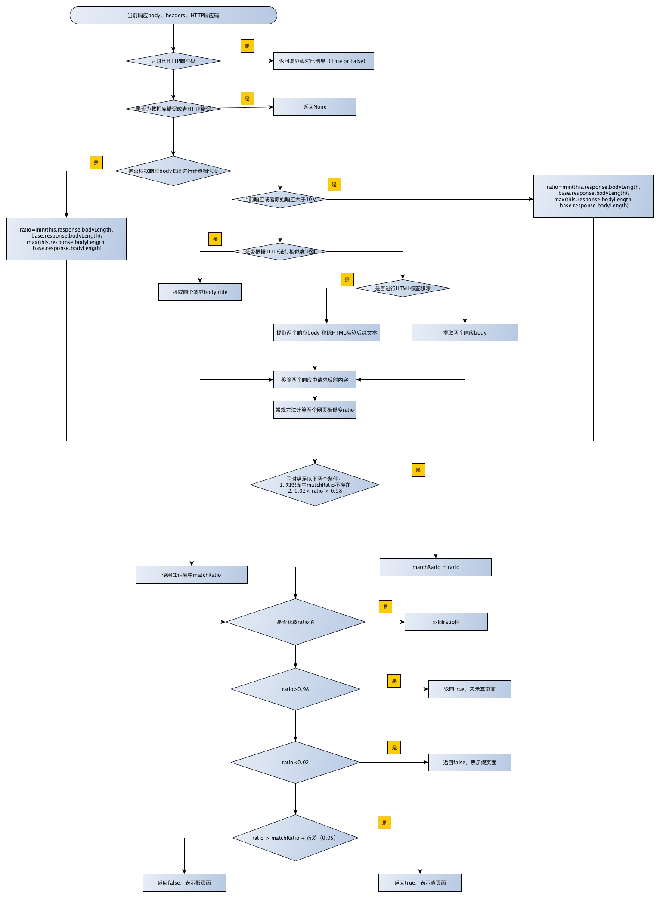

这个对比算法的输入是当前整个响应（包括状态吗、HTTP响应头、HTTP响应体），输出可以根据需求来选择（包括网页相似度比例数值ratio或者布尔值True/False），算法输出为True表示当前响应与原始响应相似，算法输出为False表示当前响应与原始响应不相似。两个响应体的相似度数值（ratio）和相似度布尔值（True/False）的关系如下图所示。

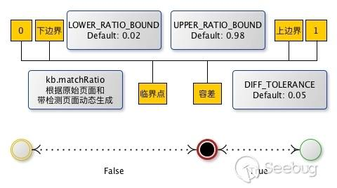

其中，ratio是一个介于0-1之间的数值。在sqlmap中，当ratio小于0.02（下边界）时，相似度布尔值为False；当ratio大于0.98（上边界）时，相似度布尔值为True；当ratio介于0.02-0.98之间的时候，当ratio &gt; 临界点（kb.matchRatio，知识库matchRatio值） + 容差（默认0.05）的时候，相似度布尔值为True，否则，相似度布尔值为False，在这种情况下，关键问题就是确定临界点。

临界点的确定方法分为两种情况，分别为：

1. 布尔盲注过程中一组真假payload对比
2. 其他

布尔盲注的临界点确定放到后续的布尔盲注过程中讲解，此处讲解第二种情况。在第二种情况下，能够产生临界点值需要两个条件同时满足，分别为：

1. 该响应需要使用响应相似度对比技术
2. 首次出现ratio值介于0.02-0.98之间

那么这个ratio值就会作为临界点值，后续会一直使用。本文后续还会出现“网页相似度”这个词语，指的是响应相似度分析技术中的HTTP body对比技术。

响应相似度对比技术作为基础技术存在与sqlmap中，在整个检测过程中会大量使用，在介绍前置发包之前，先简单介绍一下注入环境，结合具体发包来讲解，希望能够好理解一些。

### 2、注入场景

假设example.php存在一个注入点，并伴随一些随机字符串：

```text
$query = "SELECT * FROM users WHERE id=" . $_GET['id'] . " LIMIT 0, 1";
print "<br>static line<br>";
print str_rand(rand(10,20));
```

每一次响应都会返回10-20之间任意一个值的随机字符串，该注入点对应的请求为：

```text
http://target_host/example.php?id=1
```

假设MySQL数据库中存在两条记录，分别为：

```text
+----+------------------------------------+-------------------+
| id | name                               | surname           |
+----+------------------------------------+-------------------+
|  1 | luther                             | blisset           |
|  2 | fluffy                             | bunny             |
+----+------------------------------------+-------------------+
```

example.php的响应逻辑为id值为x的时候，就响应第x条数据库信息，并同时PHP错误回显打开。

至此，注入环境构建完成。

### 3、网站连通性检测

该发包的目的为网站连通性检测，流程图如下如所示：

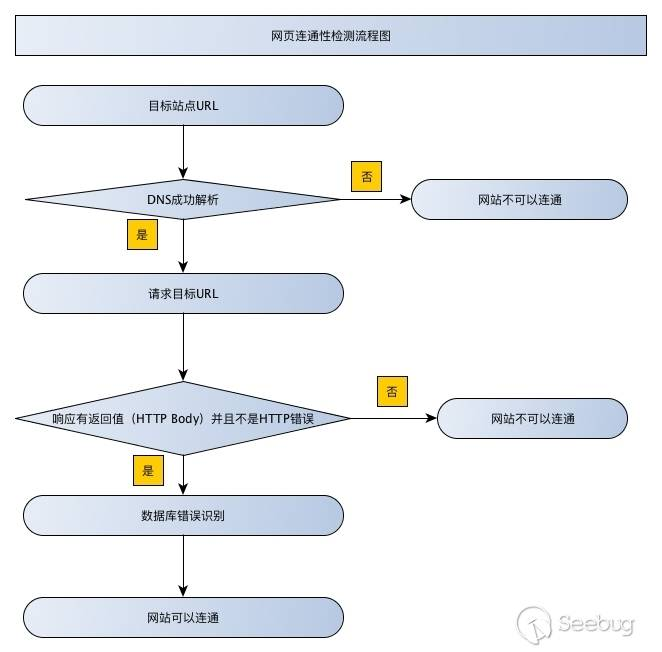

网站连通性检测的响应，会作为原始响应（响应相似度对比技术中使用）和网站模版（网站稳定性检测中使用）。

在具体场景中，发包情况如下图所示：


### 4、WAF探测

该发包的目的为检测网站是否受WAF保护，流程图如下如所示：

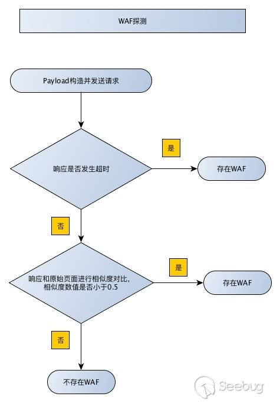

WAF探测的payload构造，在原始请求参数的基础上，增加一个新的参数，参数值设置为带有

```text
AND 1=1 UNION ALL SELECT 1,NULL,'<script>alert(\"XSS\")</script>',table_name FROM information_schema.tables WHERE 2>1--/**/; EXEC xp_cmdshell('cat ../../../etc/passwd')#
```

载荷，通常情况下就可以触发WAF。sqlmap检测到与原始请求响应相似度小于0.5时，认为存在WAF。

在具体场景中（无WAF），发包情况如下图所示：

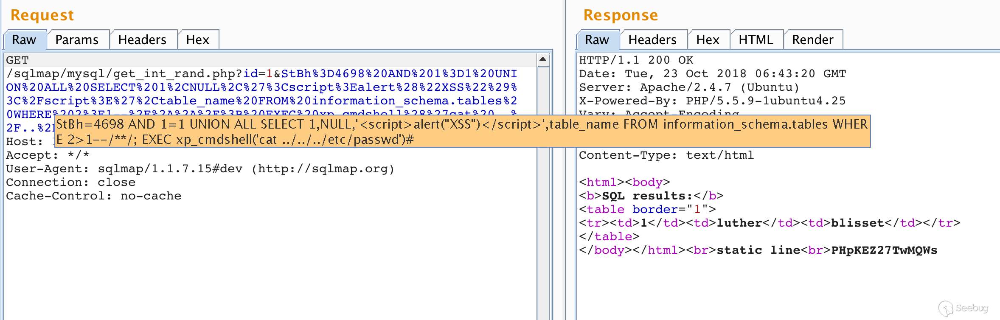

### 5、网页稳定性检测

该发包的目的为检测网页是否稳定，流程图如下如所示：

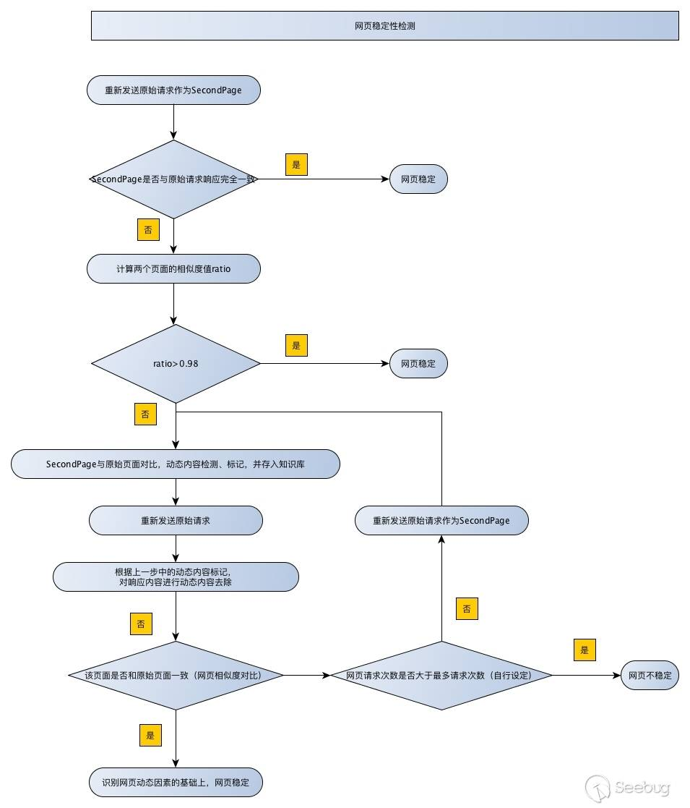

sqlmap在检验网站稳定性的过程中，如果同一个请求表现出了不同的响应，那么接下来会自动识别动态内容，并在后续响应相似度对比过程中，进行动态内容移除后再进行相似度对比。

网页稳定性检测会进行循环的动态监测，直至动态性内容全部稳定识别之后，才会进行下一步。sqlmap识别网页动态因子的时候，网页动态因子存储时候并非用的增量存储，每一次重新请求页面，都会进行重新计算动态因子，把之前动态因子的放弃。

在具体场景中，发包情况如下图所示：

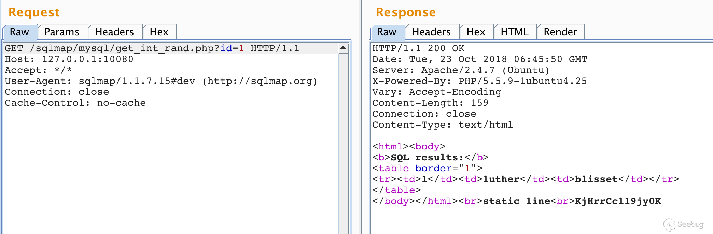

在上述环境下，网页稳定性检测过程会发包两次，第一次用于识别动态内容，第二次发包用于检验动态内容识别是否有效。对于动态响应，网页稳定性检测只有在准确识别动态内容的基础上才会进行后续处理。

### 6、参数动态性检测

该发包的目的为检测参数是否具有动态性，流程图如下如所示：

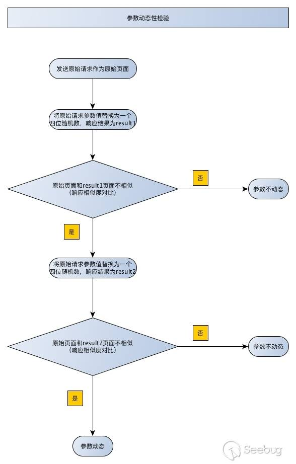

sqlmap使用两个四位数随机数进行测试，在一些情况下，假如参数没有表现出动态性，可以跳过检测，该功能在批量测试时候非常有效。

#### 重复发包问题

在sqlmap中参数动态性检验的过程中，两次生成了随机数并发包，可以理解为重复发包。针对此问题笔者也是百思不得其解，于是上Github去像作者提问，作者的回答在这里：https://github.com/sqlmapproject/sqlmap/issues/3304

sqlmap中，相同逻辑重复发包的情况也是大量存在，包括但不限于误报检测时的真假逻辑、union注入最后确认注入点是否可以多行注入等。笔者认为可能的原因是多发一个包确认情况避免误报，或者是多获得一些环境的信息（union注入多行注出）等。

在具体场景中，参数动态性检测发包情况如下图所示：


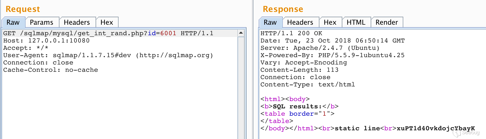

### 7、启发式注入检测

该发包尝试让Web应用报错,目的为探测该参数点是否是动态的、是否为可能的注入点，流程图如下如所示：

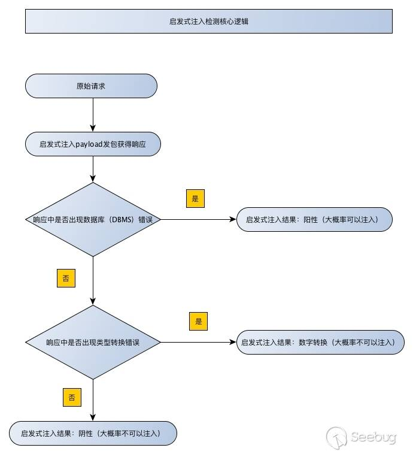

启发式注入过程中，payload生成是由`,'"().`六种字符随机组成的长度为10的字符串，同时满足'和"都只有一个。启发式注入的目的就是让Web应用报错，如果Web应用开启了错误回显，就可以快速识别DBMS（正则匹配）。

上图中为启发式注入检测核心逻辑，除此以外还有类型转换、XSS简单测试等的发包，不过笔者认为这都不是核心逻辑，并且画在图中太复杂，就没画上去。

在具体场景中，发包情况如下图所示：


### 8、误报检测

布尔盲注中使用响应相似度分析技术来确定是否存在注入点，时间盲注中使用高斯算法来确定是否存在注入点，这两种判断方式存在误报的可能，为了防止误报，sqlmap引入误报检测机制。下图为误报检测流程图：

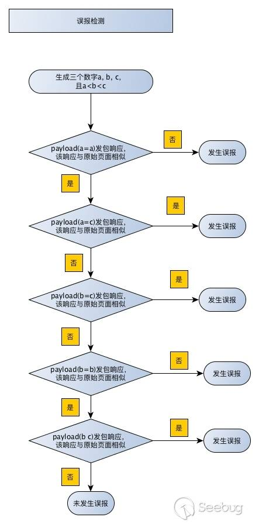

在实际误报检测过程中，使用三个数字构成不同的逻辑，使得payload主动控制响应，并根据响应判断注入是否真实存在。在使用上图中特定逻辑构造payload包的过程中，就要涉及到sqlmap中测试向量中的`<vector>`标签，这在后续布尔盲注和时间盲注过程中会进行详细分析。

误报检测的实际发包也会在布尔盲注和时间盲注过程中进行展示和分析。

## 3、sqlmap检测之布尔盲注

### 1、布尔盲注主要流程

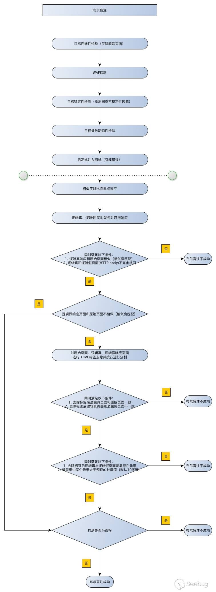

上图为布尔盲注流程图，虚线之上表示前置发包过程，虚线之下表示针对每个注入点，都会进行循环发包的流程。

在布尔盲注的前置发包过程中，可以看到有目标稳定性检测过程，在此过程中sqlmap会找出网页动态因素并在后续响应相似度分析过程中进行使用。

布尔盲注过程中大量使用响应相似度分析技术，从流程图中可以看到，在针对每一个注入点循环发包时候，sqlmap第一步就是进行临界点置空。布尔盲注中的临界点，是在发送两组真、假逻辑包时（逻辑假数据包先发送，逻辑真数据包后发送）的过程中确定的，其中某一个包计算后的ratio值介于0.02-0.98，那么该ratio值作为临界点。

在常规的响应相似度分析之后，sqlmap还包括了去除HTML标签进行注入判断，笔者认为是针对，响应数据中HTML标签量大，而数据库改变数据量小的情况。此过程中也不再使用响应相似度分析，而使用集合方式（差集）来识别注入是否存在。

误报检测逻辑在前置发包部分已有说明，后续会针对漏洞环境的发包进行分析。

### 2、布尔盲注案列分析

在上述漏洞场景中，进行布尔盲注案例分析。

首先看一下原始请求：

```text
example.php?id=1
```


可以成功注入的测试向量：

```text
<test>
    <title>AND boolean-based blind - WHERE or HAVING clause</title>
    ...
    <vector>AND [INFERENCE]</vector>
    <request>
        <payload>AND [RANDNUM]=[RANDNUM]</payload>
    </request>
    <response>
        <comparison>AND [RANDNUM]=[RANDNUM1]</comparison>
    </response>
</test>
```

根据测试向量，将`[RANDNUM]=[RANDNUM1]`随机生成两个数字，生成的逻辑假数据包如下：

```text
example.php?id=1 AND 8858=3197
```

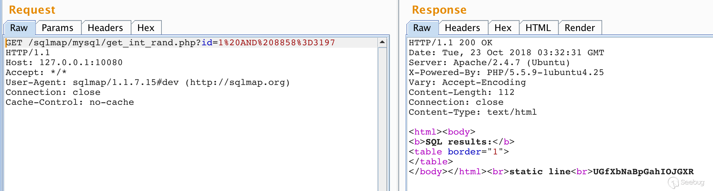

在发送第一个逻辑假包之后，sqlmap就开始进行网页相似度计算，首先移除动态随机字符串之后得出逻辑假页面与原始页面网页相似度值为0.787，并认为该页面与原始页面不相似。该网页相似度值将会被置为本组测试向量过程中的临界点，sqlmap默认的容差为0.05，也就是说，当一个响应的网页相似度大于0.792（0.787+0.05）时，sqlmap认为该响应与原始页面相似，否则，与原始页面不相似。

根据测试向量，将`[RANDNUM]=[RANDNUM]`随机生成一个数字，生成的逻辑真数据包如下：

```text
example.php?id=1 AND 1293=1293
```

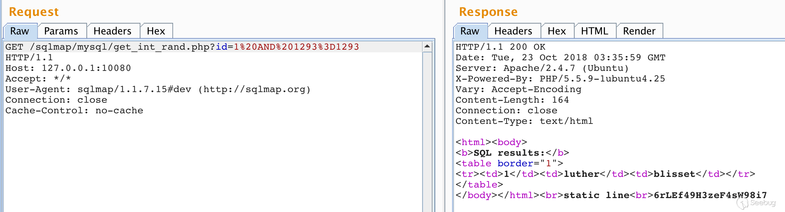

发送逻辑真请求后，sqlmap接受响应并计算网页相似度，此处计算网页相似度为1（随机字符串被移除），大于0.792，逻辑真响应与原始响应相似。

将`[RANDNUM]=[RANDNUM1]`随机生成两个数字，用于确认的逻辑假数据包如下：

```text
example.php?id=1 AND 2560=4847
```


再一次发送逻辑假请求，去除随机字符串后计算网页相似度，值为0.787，认为该网页与原始网页不相似。至此，sqlmap认为注入存在，接下来进入误报检测环节。

在布尔盲注误报检测中，会生成三个不同的数字，并有这些数字组成不同的逻辑，把这些逻辑替换测试向量中原有的逻辑，并观察响应是否如预期。回顾一下测试向量，其中包含一个`<vector>`标签，标签中的`[INFERENCE]`就是三个数字组成的逻辑替换的地方。

看一下误报检测流程图，一共有五个误报检测逻辑，在实际情况中分别为：

```text
example.php?id=1 AND 25=25
```

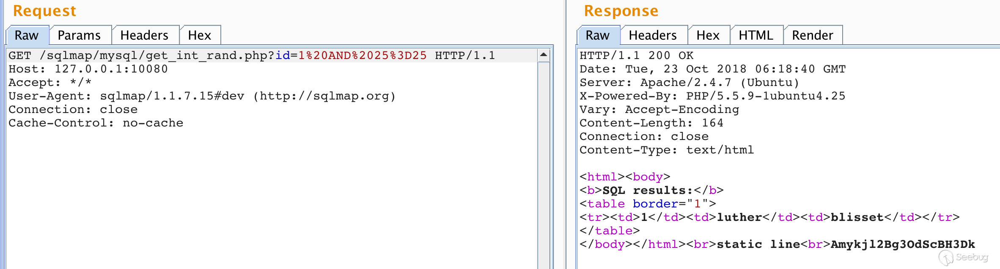

网页相似度值为1，与原始页面相似。第二个逻辑：

```text
example.php?id=1 AND 25=83
```

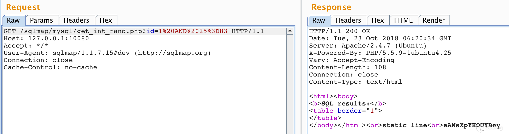

网页相似度值为0.787，与原始页面不相似。第三个逻辑：

```text
example.php?id=1 AND 83=53
```

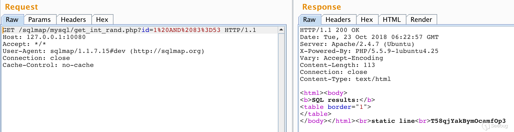

网页相似度值为0.787，与原始页面不相似。第四个逻辑：

```text
example.php?id=1 AND 53=53
```

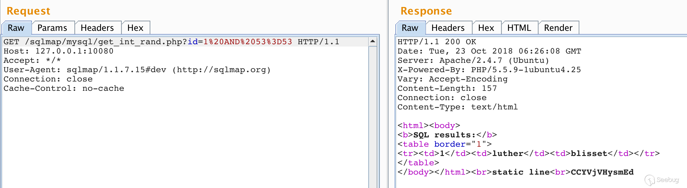

网页相似度值为1，与原始页面相似。第五个逻辑：

```text
example.php?id=1 AND 83 53
```

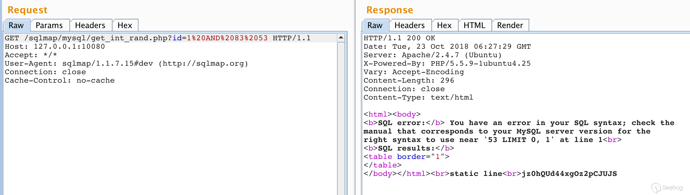

网页相似度值为0.603，与原始页面不相似。至此，误报检测完成，确定注入存在。

## 4、sqlmap检测之错误注入

### 1、错误注入主要流程

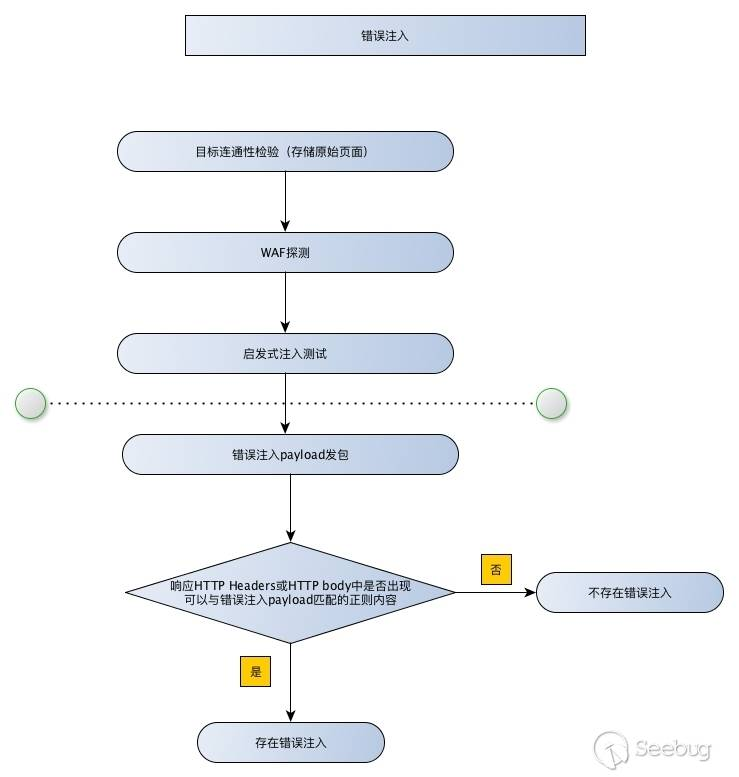

上图为错误注入流程图，虚线之上表示前置发包过程，虚线之下表示针对每个注入点，都会进行循环发包的流程。

sqlmap错误注入并不是单纯的让数据库服务器报错并回显，sqlmap是要对数据库所报出的SQL错误进行控制。错误注入的精髓在于payload，每一个payload发包的响应都有精确的正则进行匹配。如果错误注入能够成功匹配，payload中有包含SQL绝对发生执行的逻辑存在，案例分析将会详细分析。

由于错误注入的识别方式中存在正则匹配，可以理解为能够匹配的响应通常不会发生误报，因此不需要误报检测。

### 2、错误注入案例分析

在上述漏洞场景中，进行错误注入案例分析。

首先看一下原始请求：

```text
example.php?id=1
```

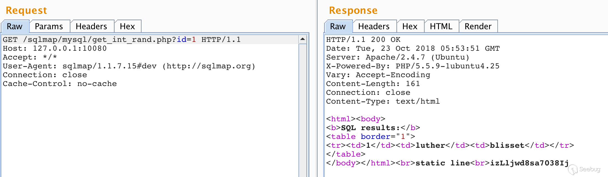

可以成功注入的测试向量：

```text
<test>
    <title>MySQL >= 5.0 AND error-based - WHERE, HAVING, ORDER BY or GROUP BY clause (FLOOR)</title>
    ...
    <request>
        <payload>AND (SELECT [RANDNUM] FROM(SELECT COUNT(*),CONCAT('[DELIMITER_START]',(SELECT (ELT([RANDNUM]=[RANDNUM],1))),'[DELIMITER_STOP]',FLOOR(RAND(0)*2))x FROM INFORMATION_SCHEMA.PLUGINS GROUP BY x)a)</payload>
    </request>
    <response>
        <grep>[DELIMITER_START](?P<result>.*?)[DELIMITER_STOP]</grep>
    </response>
    <details>
        <dbms>MySQL</dbms>
        <dbms_version> >= 5.0</dbms_version>
    </details>
</test>
```

根据测试向量，将`[RANDNUM], [DELIMITER_START], [DELIMITER_STOP]`按需进行替换，生成的逻辑假数据包如下：

```text
example.php?id=1 AND (SELECT 4229 FROM(SELECT COUNT(*),CONCAT(0x7176707871,(SELECT (ELT(4229=4229,1))),0x7176627671,FLOOR(RAND(0)*2))x FROM INFORMATION_SCHEMA.PLUGINS GROUP BY x)a)
```

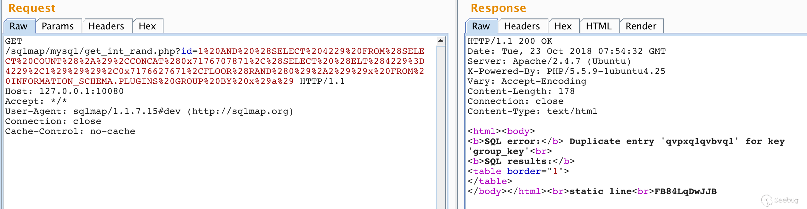

根据数据包可以看到`[RANDNUM]`值为`4229`，`[DELIMITER_START]`在payload中值为`0x7176707871`，回显时值为`qvpxq`，`[DELIMITER_STOP]`在payload中值为`0x7176627671`，回显时值为`qvbvq`。

sqlmap的错误注入是控制注入的SQL语句报出

```text
<b>SQL error:</b> Duplicate entry 'qvpxq1qvbvq1' for key 'group_key'<br>
```

这样的错误，测试向量中的正则表达（`[DELIMITER_START](?P<result>.*?)[DELIMITER_STOP]`）是正好能够提取中间的数值1。至此，错误注入存在。

## 5、sqlmap检测之union注入

### 1、union注入主要流程

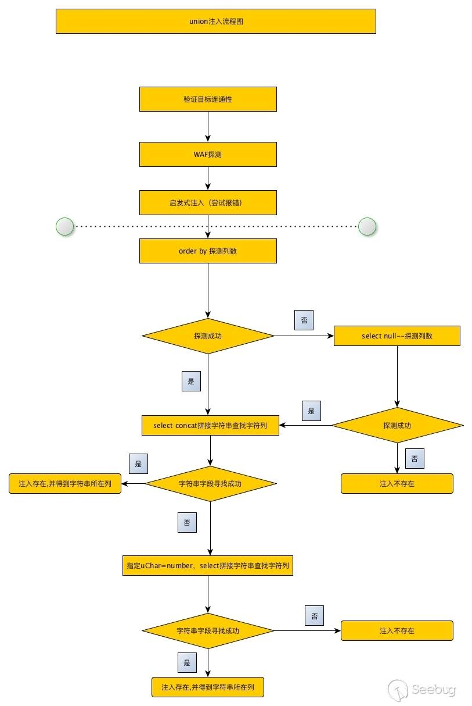

上图为union注入流程图，虚线之上表示前置发包过程，虚线之下表示针对每个注入点，都会进行循环发包的流程。

union注入是四种注入探测方式中最复杂的一种，在大的流程图下还包括

1. order by列数探测技术
2. select null列数探测技术
3. select null字符串位置确定技术

三种技术，这三种技术也包含复杂的流程和算法。单纯的union注入的前置发包过程中没有稳定性检测的部分，也就意味着单纯的union注入过程中网页相似度对比是不会进行去重的。

union注入的流程可以分为两步走，第一步为确定列数，以order by列数探测技术为主，select null列数探测技术为辅形成列数确定技术；第二步为在确定列数的基础上，查找某一个字段是字符串字段，保证数据库信息可以从该字段注出。

由于union注入的识别方式中存在正则匹配，可以理解为能够匹配的响应通常不会发生误报，因此不需要误报检测。

#### **1、order by列数探测技术**

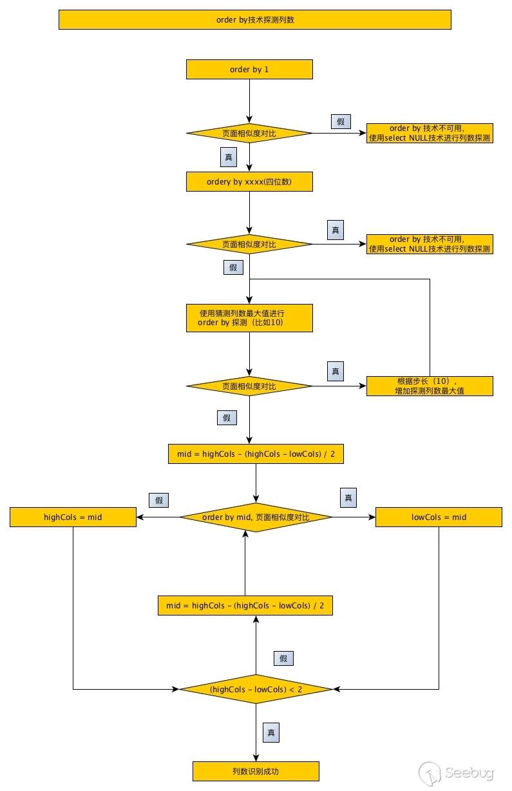

order by列数探测技术依赖于网页相似度对比技术和二分差值算法。如果order by 1，响应页面与原始页面相似，order by 1000（随机四位数），响应页面与原始页面不相似，则认为order by技术可以用于列数确定。

#### **2、select null列数探测技术**

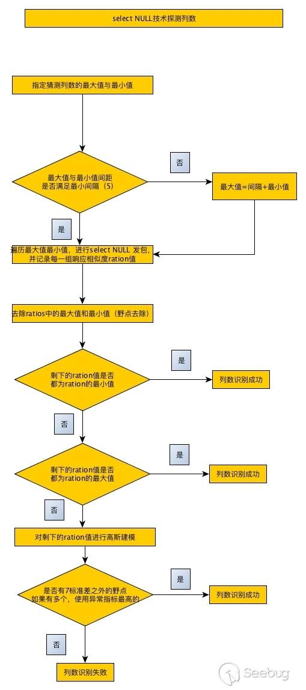

select null列数探测技术依赖于网页相似度对比技术和高斯分布（正态分布），以下说明可以结合案例分析一起解读。

select null列数探测技术在进行时，会首先指定列数猜测过程中的最大值与最小值（指定列数 最少/最小值 为1，最多/最大值 为10），sqlmap会同时发送10个数据包，包含1个NULL至10个NULL，取回10个包的响应后进行网页相似度分析，并获取网页相似度数值（共10个，非True/False）。在这10个数值中，如果select null列数探测成功，那么成功那个响应的网页相似度数值只可能是最大值或者最小值。对10个数值中去除最大值和最小值后，留下8个值，可以认为，这8个值都是列数猜测不成功返回的响应，对这个8个数据进行高斯分布建模，得出的模型就是列数猜测不成功的模型。现在使用最大值或者最小值来计算是否符合这个不成功的模型，如果符合，说明这个数据也是列数猜测不成功的响应，如果不符合，说明这个数据也是列数猜测成功的响应。

高斯分布属于异常检测算法的一种，以下是笔者认为理解该算法的一些关键点：

* 为何要用异常检测算法

网站的响应是基于逻辑的，如果一组请求，网站的处理逻辑相同，那么响应几乎也是相同的。 如果某一个响应出现了变化，那么我们认为，网站处理逻辑变了，这种逻辑的变化，可能是注入成功了，因为一组请求里只有一个请求可能成功，那么这个点可以认为是异常点。

* 建模思路

在union注入中，由于只使用网页相似度作为建模（高斯分布）指标，那么异常值只可能在最大值或者最小值，去除掉两个可能值之后的数据，就都是一个逻辑出来的数据（即注入不成功），使用注入不成功的数据进行高斯建模（这也是为啥select null技术猜测列数需要有最小跨度的原因，数据太少，没法建模，数据越多，模型越准确），出来的模型就是注入不成功的模型，也就是说，服从这个模型的数据99.99%的概率是不成功的，而不服从这个分布（异常点）也就是注入成功的了。

* union注入中为何使用相似度作为高斯建模的唯一自变量

union注入是一种回显形式的注入攻击，响应文本内容是union注入是否最明显的判断方式。由于存在诸多的类似不可控广告这样的噪声内容存在，对于机器来说，使用相似度来判断页面内容是方便合理的。比如时间注入，使用响应时间作为分布会更合理。

* 7个标准差代表什么

7个标准差在这里把一组数据一分为二，代表着分开的两组数据产生于不同的机制，在这里也就是网站处理逻辑不一样，一种是成功执行SQL语句，一种是没有成功执行SQL语句。

#### **3、select null字符串位置确定技术**

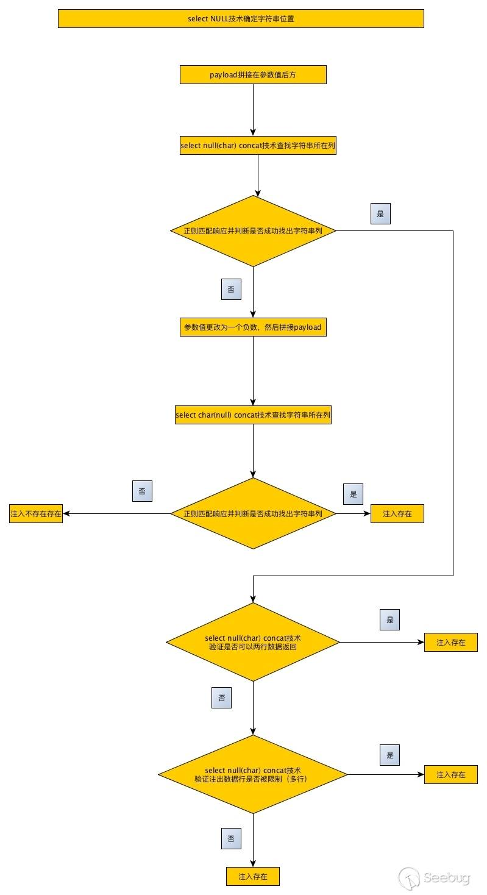

select null字符串位置确定技术依赖于正则匹配技术，这是的union注入不需要误报检测流程。select null字符串位置确定的过程中，如果遇到NULL字符串无法成功找出字符串位置，那么sqlmap会自动指定一个数字替换payload中NULL字符串，并且payload的组合方式会发生改变（payload拼接在参数值后方 改为 参数值更改为一个负数，然后拼接payload），以保证指定的数字能够回显在响应中。

### 2、union注入案例分析

在上述漏洞场景中，进行union注入案例分析。

首先看一下原始请求：

```text
example.php?id=1
```


可以成功注入的测试向量：

```text
<test>
    <title>Generic UNION query (NULL) - 1 to 10 columns</title>
    ...
    <request>
        <payload/>
        <comment>[GENERIC_SQL_COMMENT]</comment>
        <char>NULL</char>
        <columns>1-10</columns>
    </request>
    <response>
        <union/>
    </response>
</test>
```

根据测试向量，我们可以知道猜测列数的最大值为10，最小值为1。此处，笔者跳过使用order by技术探测列数，使用select null技术进行列数探测。

猜测列数的范围为1-10，因此发送10个数据包，第一个数据包：

```text
example.php?id=1 UNION ALL SELECT NULL-- fVTK
```

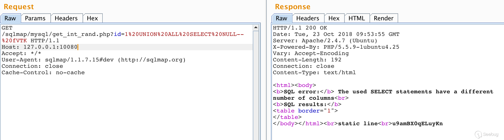

这个数据包的网页相似度数值为0.714，第二个数据包：

```text
example.php?id=1 UNION ALL SELECT NULL,NULL-- jmEt
```

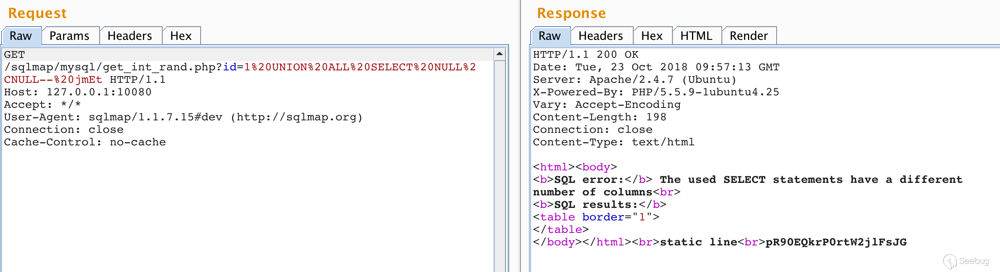

这个数据包的网页相似度数值为0.726，第三个数据包：

```text
example.php?id=1 UNION ALL SELECT NULL,NULL,NULL-- cRud
```

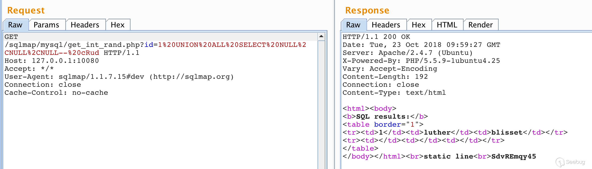

这个数据包的网页相似度数值为0.834，第四个数据包：

```text
example.php?id=1 UNION ALL SELECT NULL,NULL,NULL,NULL-- AqEV
```

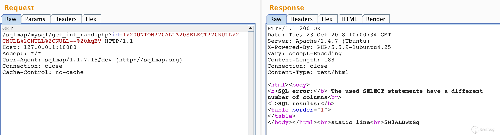

这个数据包的网页相似度数值为0.716，第五个数据包：

```text
example.php?id=1 UNION ALL SELECT NULL,NULL,NULL,NULL,NULL-- NvIh
```

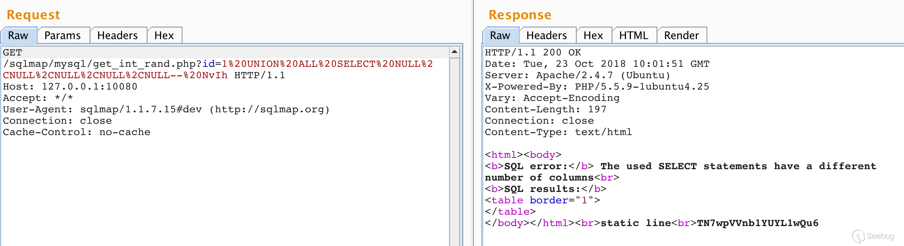

这个数据包的网页相似度数值为0.71，第六个数据包：

```text
example.php?id=1 UNION ALL SELECT NULL,NULL,NULL,NULL,NULL,NULL-- qrAS
```

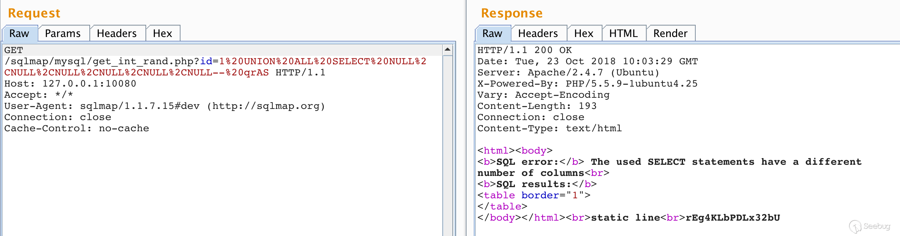

这个数据包的网页相似度数值为0.723，第七个数据包：

```text
example.php?id=1 UNION ALL SELECT NULL,NULL,NULL,NULL,NULL,NULL,NULL-- mmxs
```

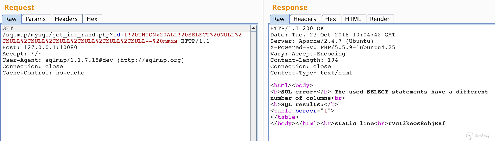

这个数据包的网页相似度数值为0.724，第八个数据包：

```text
example.php?id=1 UNION ALL SELECT NULL,NULL,NULL,NULL,NULL,NULL,NULL,NULL-- moNa
```

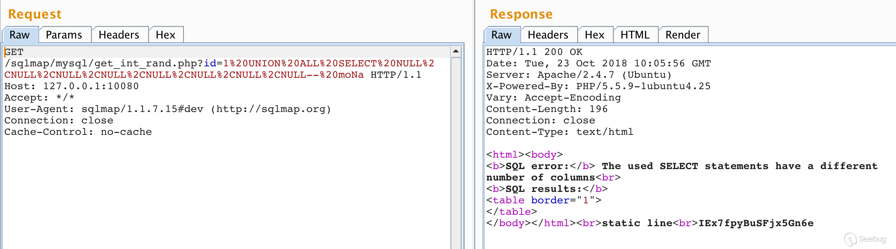

这个数据包的网页相似度数值为0.723，第九个数据包：

```text
example.php?id=1 UNION ALL SELECT NULL,NULL,NULL,NULL,NULL,NULL,NULL,NULL,NULL-- vHbn
```

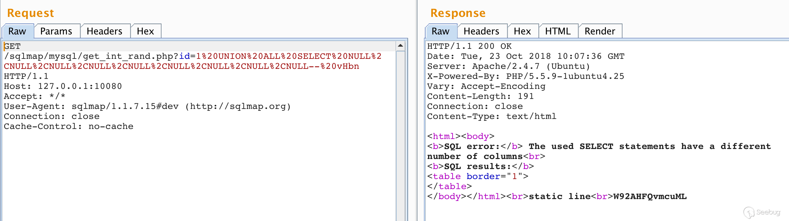

这个数据包的网页相似度数值为0.725，第十个数据包：

```text
example.php?id=1 UNION ALL SELECT NULL,NULL,NULL,NULL,NULL,NULL,NULL,NULL,NULL,NULL-- bVyF
```

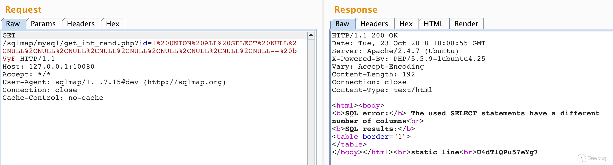

这个数据包的网页相似度数值为0.722。

得到十个网页相似度数值，其中最大值为0.834，最小值为0.71，去除最大值最小值后，通过剩余的8个数据计算标准差为0.00430738568375，均值为0.721625。

* 上边界 = 均值 + 7 \* 标准差 = 0.751776699786
* 下边界 = 均值 - 7 \* 标准差 = 0.691473300214

这意味着，网页相似度值大于上边界或者小于下边界，就是成功找到的列数，0.834对应的NULL的数量就是列数，为3。至此，列数探测成功。

接下来使用select null技术来确定字符串位置，三列中随机找一个位置，插入字符串拼接语法，观察响应是否能够正确回显特定字符串，数据包如下：

```text
example.php?id=1 UNION ALL SELECT NULL,CONCAT(0x71707a7a71,0x625448774650554f4d435a696567784762446b776b5a53646c567a475259776c586a53694e675267,0x7178767671),NULL-- VdhL
```

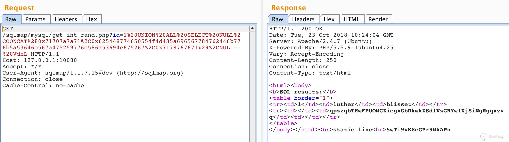

## 6、sqlmap检测之时间盲注

### 1、时间盲注主要流程

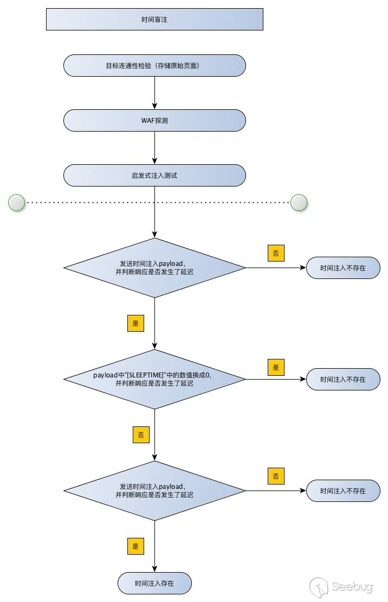

上图为时间盲注流程图，虚线之上表示前置发包过程，虚线之下表示针对每个注入点，都会进行循环发包的流程。

时间盲注过程中大量使用响应延迟判断技术，从流程图中可以看到，在针对每一个注入点循环发包时候，一共使用了三次响应延迟判断技术。

误报检测逻辑在前置发包部分已有说明，后续会针对漏洞环境的发包进行分析

#### **响应延迟判断技术**

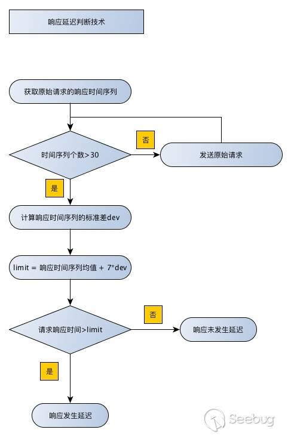

 响应延迟判断技术使用了高斯分布（正态分布，详见select null列数探测技术）。在sqlmap时间盲注的测试向量库中，有包含准确的延迟时间如`[SLEEPTIME]`变量和进行大量计算进行延迟的`[DELAY]`等两种payload。高斯分布可以识别一个响应是否与普通响应产生于一种机制，因此，`[SLEEPTIME]`和`[DELAY]`就可以放在一种情况进行讨论，因为salmap区分的是响应机制。

### 2、时间盲注案例分析

在上述漏洞场景中，进行时间盲注案例分析。

首先看一下原始请求：

```text
example.php?id=1
```


可以成功注入的测试向量：

```text
<test>
    <title>MySQL >= 5.0.12 AND time-based blind</title>
    ...
    <vector>AND [RANDNUM]=IF(([INFERENCE]),SLEEP([SLEEPTIME]),[RANDNUM])</vector>
    <request>
        <payload>AND SLEEP([SLEEPTIME])</payload>
    </request>
    <response>
        <time>[SLEEPTIME]</time>
    </response>
    <details>
        <dbms>MySQL</dbms>
        <dbms_version> >= 5.0.12</dbms_version>
    </details>
</test>
```

在进入正式测试之前，由于响应延迟判断技术需要大量的正常响应作为高斯分布建模的数据，因此sqlmap会发送30次原始请求作为数据源。

根据测试向量，将`[SLEEPTIME]`随机生成一个数字，生成的数据包如下：

```text
example.php?id=1 AND SLEEP(5)
```

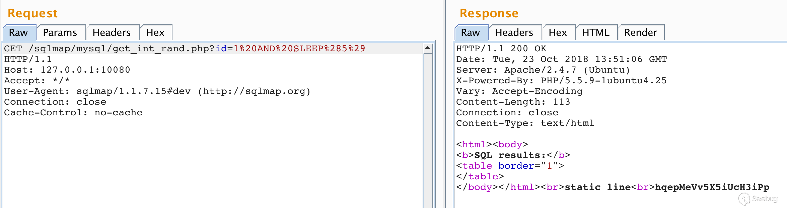

发送该请求后，响应发生了延迟。此时，sqlmap将`[SLEEPTIME]`值设置为0，生成的数据包如下：

```text
example.php?id=1 AND SLEEP(0)
```

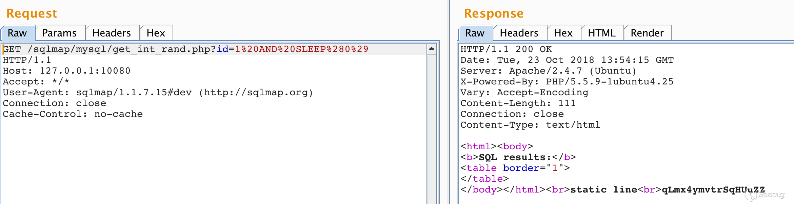

发送该请求后，响应未发生延迟。sqlmap将`[SLEEPTIME]`值设置为第一次发包的值，生成的逻辑真数据包如下：

```text
example.php?id=1 AND SLEEP(5)
```

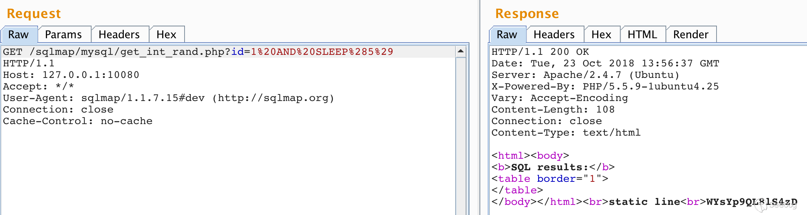

发送该请求后，响应发生了延迟。至此，sqlmap认为注入存在，接下来进入误报检测环节。

在时间盲注误报检测中，会生成三个不同的数字，并有这些数字组成不同的逻辑，把这些逻辑替换测试向量中原有的逻辑，并观察响应是否如预期。回顾一下测试向量，其中包含一个`<vector>`标签，标签中的`[INFERENCE]`就是三个数字逻辑替换的地方。

看一下误报检测流程图，一共有五个误报检测逻辑，在实际情况中分别为：

```text
example.php?id=1 AND 9187=IF((19=19),SLEEP(5),9187)
```

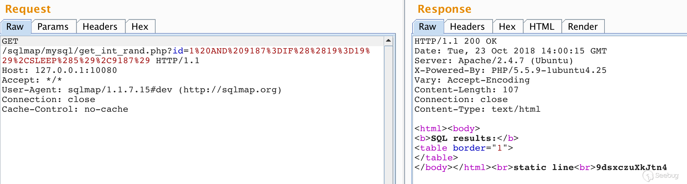

响应发生了延迟。第二个逻辑：

```text
example.php?id=1 AND 7052=IF((19=55),SLEEP(5),7052)
```

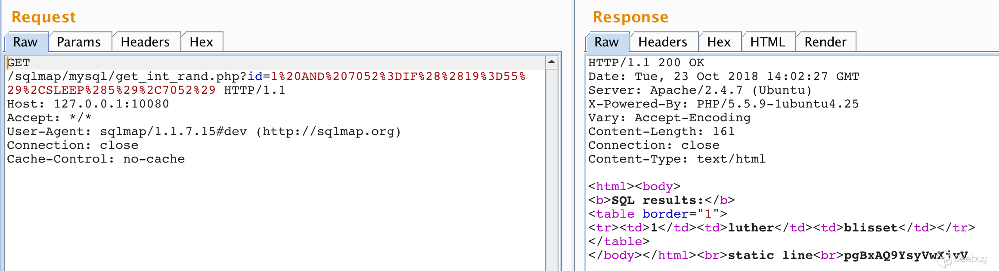

响应未发生延迟。第三个逻辑：

```text
example.php?id=1 AND 1148=IF((19=58),SLEEP(5),1148)
```

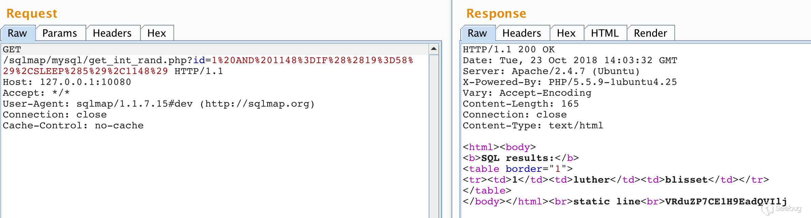

响应未发生延迟。第四个逻辑：

```text
example.php?id=1 AND 6574=IF((55=55),SLEEP(5),6574)
```

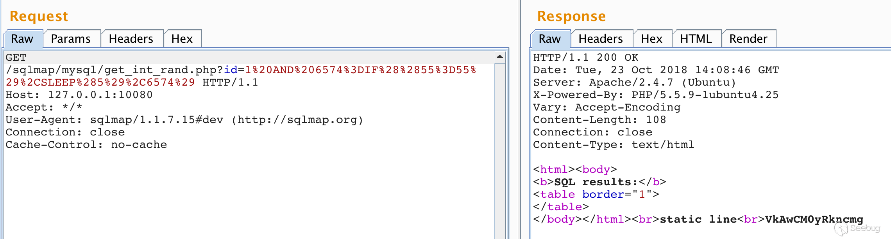

响应发生了延迟。第五个逻辑：

```text
example.php?id=1 AND 4482=IF((58 55),SLEEP(5),4482)
```

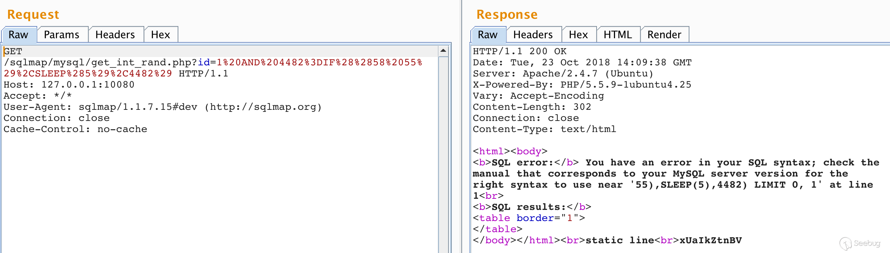

响应未发生延迟。至此，误报检测完成，确定注入存在

