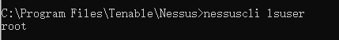

# NESSUS

## 相关答疑

### 账号密码忘了？

忘记账号，可以打开 管理员权限的 CMD，跳转到 Nessus 目录下，执行：

```
nessuscli lsuser
```

<figure><figcaption></figcaption></figure>

如果是忘记密码或重置密码，可以执行命令

```
nessuscli chpasswd Nessus(用户名)
```

### 更新Nessus

还是，管理员权限CMD，执行命令

```
nessuscli update --all
## 更新插件
nessuscli update --plugins-only
```
